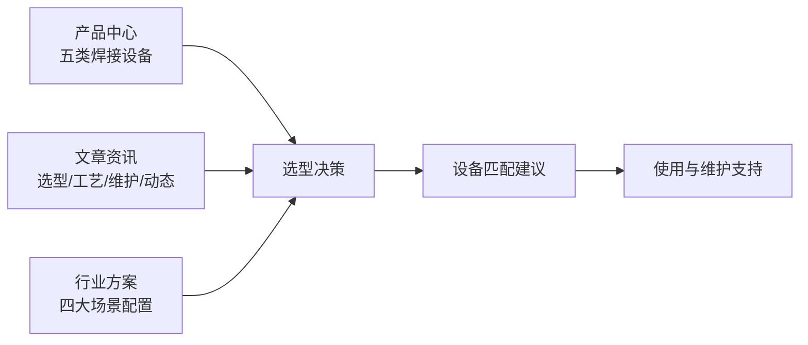

# 关于我们

电焊机.cn 是一个聚焦**焊接设备选型与技术内容**的平台。我们做的事情很具体：把电焊机选型、参数解读、工艺要点、使用维护这些实际问题讲清楚，让采购者和使用者少走弯路。

## 我们在做什么

| 做的事 | 具体内容 |
|--------|---------|
| 产品归类与参数整理 | 按工艺类别梳理五大类焊接设备，逐项列出关键参数与适用工况 |
| 选型方法输出 | 把"按板厚—材质—供电定机型"的推导过程写成可复用路径 |
| 行业方案编制 | 钢结构、压力容器、汽车维修、门窗加工等场景的完整配置逻辑 |
| 使用与维护知识 | 保养周期、故障排查、常见焊接缺陷的成因与对策 |
| 技术文章持续更新 | 按用户高频提问组织选题，内容持续新增 |

## 内容原则

**1. 参数口径透明**

我们尽量给出具体的数值区间（电流范围、板厚范围、负载持续率、气流量等），而不是"高性能""超大功率"这类无法验证的表述。文中的参数是**通用参考范围**，具体机型的实际参数以厂商说明书为准。

**2. 不绑定单一品牌**

内容聚焦工艺与配置逻辑，而非推销特定型号。这样内容在换供应商后依然有效，也避免因产品迭代导致信息过期。

**3. 结论前置**

每篇文章开头给出直接结论，正文用表格和小标题组织，方便快速定位答案——也方便被搜索和引用。

**4. 安全提示不省略**

焊接是高危作业。涉及安全的环节（气体存放、密闭空间、镀锌板烟尘、电容放电等）都会明确标注，不为了内容简洁而略过。

## 内容覆盖范围

## 免责声明

本站内容为**技术参考信息**，用于帮助理解焊接设备的基本原理、参数含义与通用工艺方法。

- 文中参数区间为通用参考值，不构成对任何具体产品的性能承诺
- 涉及安全规范、行业标准、特种设备监管要求的内容，请以**现行法规标准及当地监管部门的规定**为准
- 焊接作业存在火灾、触电、有害气体等风险，请务必由具备相应能力的人员操作并采取合规的防护措施
- 具体设备的选型、安装与使用，请以该设备的技术说明书与厂商指导为准

## 联系我们

如有选型咨询、内容建议或合作意向，欢迎通过以下方式联系：

- **邮箱**：mfujun@agent.qq.com
- **留言表单**：[前往联系页面](/contact)

我们通常会在收到留言后尽快回复。为了提高沟通效率，建议在留言中写明：**母材材质、板厚范围、供电条件（220V/380V）、日焊接量、预算区间**。
