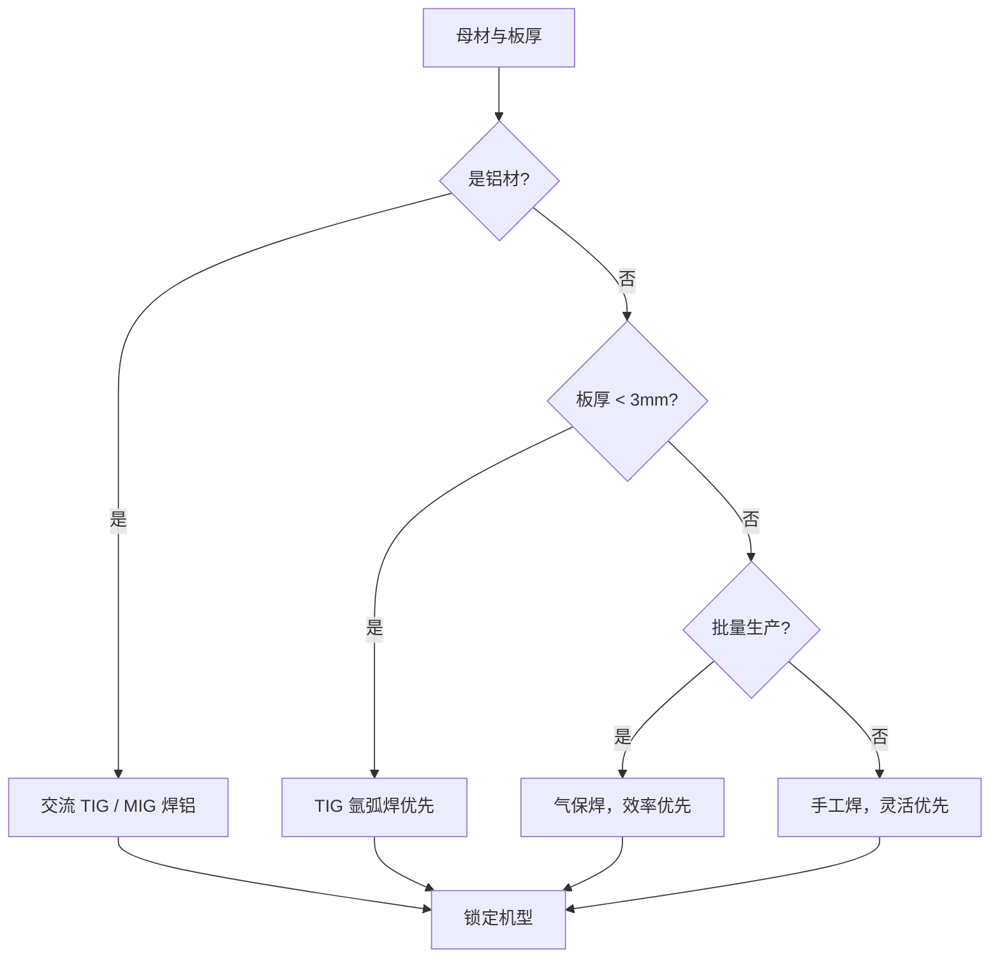

# 电焊机怎么选？按板厚、材质、供电三步定机型

> **一句话结论**：选电焊机的正确顺序是 **先看母材与板厚 → 再定焊接工艺 → 最后按供电条件锁定机型**。跳过前两步直接比价格，几乎一定会买错。

## 第一步：确认母材与板厚

母材决定工艺上限，板厚决定电流区间。这是最基础也最容易被忽略的一步。

| 母材 | 常用工艺 | 关键说明 |
|------|---------|---------|
| 碳钢 / 低合金钢 | 手工焊、气保焊 | 最通用，机型选择最广 |
| 不锈钢 | TIG 氩弧焊、气保焊（不锈钢焊丝） | 薄板优先 TIG，中厚板可气保焊 |
| 铝及铝合金 | **交流 TIG**、MIG 焊铝 | 必须交流，直流机焊不上 |
| 镀锌板 | 气保焊（药芯焊丝更适合） | 锌层会产生烟尘，需通风 |

板厚与电流、焊条/焊丝的对应关系：

| 板厚 | 工艺建议 | 焊条/焊丝 | 参考电流 |
|------|---------|----------|---------|
| 0.5–2mm | TIG、脉冲气保焊 | 1.6–2.0 焊条 / 0.8 焊丝 | 30–80A |
| 2–4mm | 手工焊、气保焊 | 2.5 焊条 / 0.8–1.0 焊丝 | 70–130A |
| 4–8mm | 手工焊、气保焊 | 3.2 焊条 / 1.0–1.2 焊丝 | 110–200A |
| 8–20mm | 气保焊多层多道 | 1.2–1.6 焊丝 | 200–350A |
| 20mm 以上 | 埋弧焊、大功率气保焊 | 按工艺定 | 350A 以上 |

## 第二步：确定焊接工艺

四种工艺的定位差异：

| 工艺 | 效率 | 焊缝质量 | 灵活性 | 适合谁 |
|------|------|---------|-------|-------|
| 手工焊（MMA） | 中 | 中 | **高** | 维修、户外、杂活 |
| 气保焊（MIG/MAG） | **高** | 良 | 中 | 加工厂批量生产 |
| 氩弧焊（TIG） | 低 | **优** | 中 | 薄板、不锈钢、打底 |
| 等离子切割 | — | — | 中 | 下料配套（非焊接） |

## 第三步：核对供电条件

| 现场条件 | 可选机型 | 电流上限 | 注意事项 |
|---------|---------|---------|---------|
| 仅有单相 220V | 便携机、小型手工焊机 | 约 200A | 需 16A 以上独立回路、≥2.5mm² 导线 |
| 有 380V 三相 | 全品类 | 400–500A | 需确认空开容量与线径 |
| 临时流动施工 | 双电压机型 | 视机型 | 220V/380V 切换须按说明书操作 |

> **常见误判**：很多用户以为"有 220V 插座就能用大焊机"。实际上 400A 级焊机在 220V 下需要 40A 以上输入电流，家用线路根本带不动，会频繁跳闸甚至损坏设备。

## 第四步：核对负载持续率

负载持续率决定"能不能连续干活"，是区分生产型与维修型设备的关键指标。

| 负载持续率 | 10 分钟内可焊 | 适合场景 |
|-----------|-------------|---------|
| 35% | 3.5 分钟 | 家庭、间歇维修 |
| 60% | 6 分钟 | 一般加工厂 |
| 100% | 连续工作 | 流水线、自动化 |

**判断方法**：估算您一天的**实际焊接时长**。每天连续焊接超过 3 小时，就应优先选 60% 以上机型；否则 35% 机型在价格上更划算。

## 第五步：确认配套与后续成本

设备本身只是一部分，配套件与耗材常被忽略：

| 配套项 | 说明 | 成本量级 |
|--------|------|---------|
| 焊把/焊枪 | 接口规格需与主机匹配 | 中 |
| 地线夹与电缆 | 截面按电流选，过细会发热 | 低 |
| 气瓶与减压流量计（气保焊/TIG） | 需按当地规定合规租用与存放 | 中 |
| 焊条/焊丝 | 持续消耗 | 持续 |
| 易损件（导电嘴、喷嘴、电极） | 等离子与气保焊尤需关注 | 持续 |
| 供电改造（拉专线） | 大功率机型的隐性成本 | 视现场 |

## 常见问题（FAQ）

### Q1：预算有限，优先保哪个参数？

优先保**额定负载持续率下的输出电流**，而不是峰值电流。一台额定 60%@200A 的机器，实际干活能力胜过标注"最大 250A"但额定只有 35%@140A 的机器。这是同价位机型最本质的差别。

### Q2：加工厂第一次买设备，一台还是两台？

建议按主工艺先买一台主力机（通常是气保焊），手工焊作为补充可后置。两台机器如果都买低配，反而不如一台配置到位的。若预算确实有限，可选带 MMA 功能的气保焊一体机过渡。

### Q3：二手机器值得买吗？

懂行且能现场试焊时可以考虑，但要注意：① 无法确认使用时长与内部器件老化程度；② 保修基本为零；③ 型号可能已停产导致配件难配。省下的钱往往会在后续维修和停机里花回去。

### Q4：网上报价差别很大，怎么判断靠不靠谱？

看三点：**是否标清额定负载持续率**、**是否有完整的输入/输出参数**、**是否有明确的售后与质保条款**。只标"最大电流"和"超大功率"却不说负载持续率的，通常存在虚标。详见[参数怎么看](/articles/welder-parameters)。

**按您的实际工况给建议？** 把母材材质、板厚、供电条件、日焊接量与预算区间发到 **mfujun@agent.qq.com**，或在[联系页面](/contact)留言。

