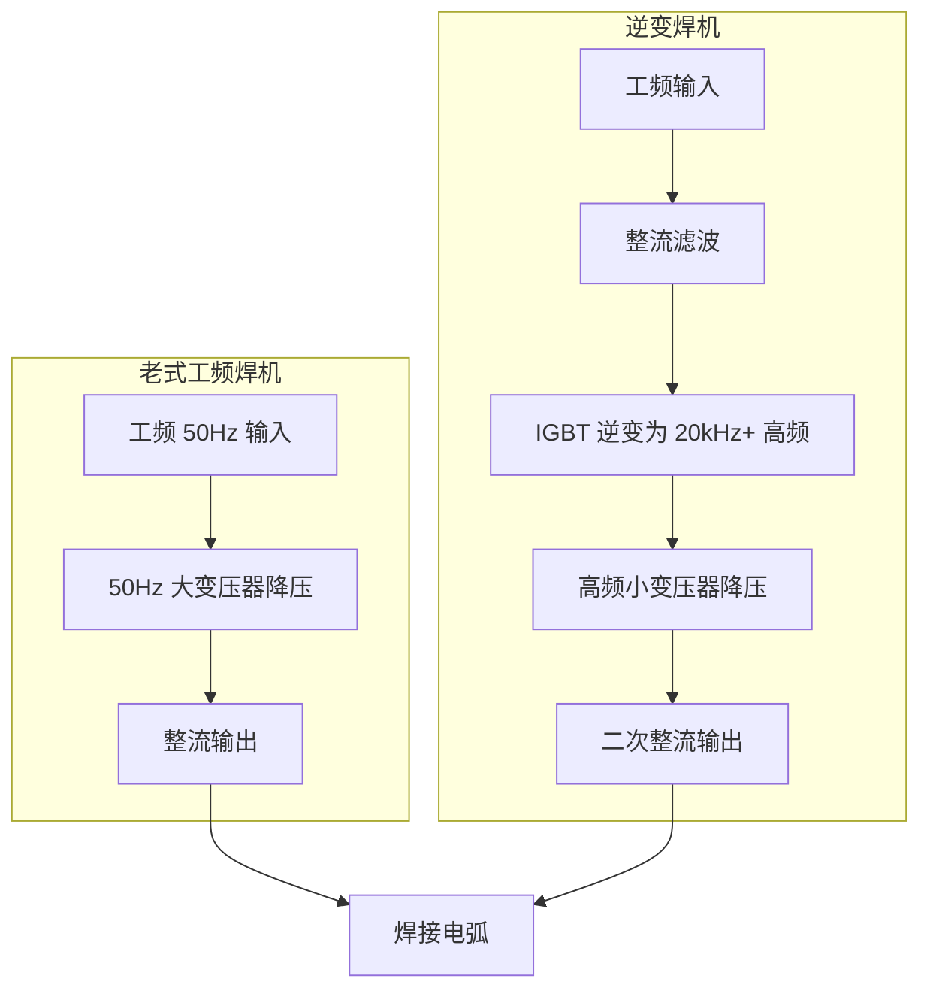

# 逆变焊机为什么取代了老式焊机？技术原理与选型影响

> **一句话结论**：逆变焊机把工频电提升到 20kHz 以上高频再降压，变压器和电感体积大幅缩小，因此**重量只有老式机的 1/5–1/10、能耗低约 20%–30%、电弧更稳**。这三点正在改变采购决策的标准。

## 老式焊机与逆变焊机的技术路径

**核心差异在于频率**。变压器铁芯截面积与工作频率成反比：频率从 50Hz 提到 20kHz（400 倍），铁芯体积可缩小一个数量级以上。这就是逆变焊机轻便的根本原因。

## 逆变技术的五项实际优势

| 优势 | 具体表现 | 对采购的意义 |
|------|---------|-------------|
| 重量轻 | 400A 机型可做到 15–25kg（老式机 100kg 以上） | 流动施工、多工位共享成为可能 |
| 能耗低 | 效率 ≥85%，老式机约 60%–70% | 长期作业电费差异显著 |
| 电弧稳 | 输出直流，纹波小 | 焊接质量提升，飞溅减少 |
| 功能多 | 易集成脉冲、防粘条、VRD、数字化面板 | 一台机覆盖更多工艺 |
| 用料省 | 铜铁用量大幅减少 | 同等性能下价格更有竞争力 |

## 直流输出为什么重要

逆变焊机输出的是**直流电**，这是相对老式交流焊机的关键跃升：

| 对比项 | 交流焊机 | 直流逆变焊机 |
|--------|---------|-------------|
| 可用焊条 | 仅酸性焊条（如 J422） | 酸性 + **碱性焊条**（如 J507） |
| 电弧稳定性 | 过零点熄弧，需稳弧装置 | 无过零问题，电弧连续 |
| 焊接位置 | 全位置较困难 | 全位置适应性好 |
| 焊缝质量 | 一般 | 更好，尤其碱性焊条成型佳 |

> **实用结论**：需要焊重要结构件（要求用碱性焊条）时，交流焊机从原理上就做不到。这是很多工程规范直接要求直流焊机的原因。

## 能耗差异的量化

以 350A 级手工焊机、每天实际焊接 4 小时、年 250 个工作日估算：

| 项目 | 老式工频焊机 | 逆变焊机 | 差异 |
|------|-------------|---------|------|
| 效率 | 约 65% | 约 88% | — |
| 折算输入功率（对应输出） | 约 21 kVA | 约 15.5 kVA | — |
| 年耗电量（估算） | 约 1.7 万度 | 约 1.25 万度 | **节省约 4500 度** |

按工业电价折算，一年多省下的电费即可覆盖相当比例的设备差价。**作业量越大，逆变机的经济性越明显。**

## 对选型决策的三个影响

### 影响一：不要再用重量判断功率

老式机时代"越重越有料"的经验在逆变机上不成立。判断实际能力要看**额定负载持续率下的输出电流**，而非重量。详见[参数怎么看](/articles/welder-parameters)。

### 影响二：散热设计成为质量分水岭

逆变机功率密度高，散热设计是核心门槛。选购时关注：

- 散热片面积与风道设计
- 是否采用温控风扇（按温度自动调速）
- 功率器件品牌与裕量设计
- 防护等级是否匹配使用环境

### 影响三：功能集成度带来"一机多能"

数字化逆变平台容易集成多种工艺。常见组合：

| 组合 | 覆盖工艺 | 适合谁 |
|------|---------|-------|
| 手工焊 + TIG | MMA + 氩弧焊 | 不锈钢加工、维修 |
| 手工焊 + 气保焊 | MMA + MIG/MAG | 中小加工厂 |
| 气保焊 + 手工焊 + 氩弧焊 | 三合一 | 多品类小批量工厂 |
| 手工焊 + 等离子切割 | 焊接 + 下料 | 现场安装队 |

一体化机型省了设备投入和占地，但**单项性能通常不如同价位专机**，需按主要工艺权衡。

## 常见问题（FAQ）

### Q1：逆变焊机故障率高吗？

逆变机电路更复杂（多级功率变换 + 控制板），理论上故障点比老式机多。但实际表现为**"电路板级"故障 vs 老式机的"绕组级"故障**。做好清灰散热与干燥存放，逆变机的故障率完全可以接受；而散热不良是逆变机的头号杀手。

### Q2：维修逆变焊机比老式机贵吗？

单次维修成本通常更高（控制板、IGBT 模块更换费用高），但老式机维修主要是重绕变压器，费用也不低且更频繁。**关键差异是停机时间**：老式机可用部件替代临时修复，逆变机往往需要等配件。这也是很多工厂保留一台老式机做备份的原因。

### Q3：老式焊机是不是完全没价值了？

不是。老式工频焊机结构简单、抗过载能力强、维修门槛低，在**极端恶劣环境**（高粉尘、高湿度、电网质量差）下仍有生命力，且价格低廉。对于偶尔使用、对重量不敏感的固定工位，仍是经济选择。

### Q4：现在市面上还有假的逆变机吗？

有。部分低价产品是"伪逆变"——内部仍用大变压器，只是加了个数字化面板和外壳。判别方法：**看重量和体积**。真正的 200A 逆变机通常 3–6kg，若同规格产品重达 20kg 以上，需要存疑。

**需要评估现有设备的替换收益？** 把当前机型、日均焊接时长与电价发到 **mfujun@agent.qq.com**，或在[联系页面](/contact)留言，我们可以帮您做能耗对比估算。

