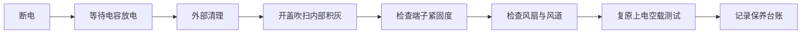

# 电焊机保养周期表：多久清灰、多久查线、多久通电驱潮

> **一句话结论**：焊机故障里超过一半来自**积灰散热不良**和**接线端子松动发热**。按班次、每周、每月、每季度四档执行保养，能用最低成本换回最长寿命。

## 保养周期总表

| 周期 | 保养项 | 耗时 | 不做会怎样 |
|------|--------|------|-----------|
| 每班次 | 清理飞溅、检查喷嘴/导电嘴、查气路 | 2 分钟 | 送丝不畅、气孔率上升 |
| 每周 | 查送丝轮、查气路密封、检查线缆 | 10 分钟 | 送丝不稳、气体浪费 |
| 每月 | 紧固端子、查风扇、清理外表 | 20 分钟 | 端子发热烧毁、过热保护频发 |
| 每季度 | **内部吹灰**、通电驱潮、绝缘检查 | 30 分钟 | 散热恶化、元件击穿 |
| 每年 | 全面检查、电容检测、更换老化线缆 | 半天 | 突发停机 |

## 保养流程图

> **第一步永远断电等放电**。逆变焊机内部有大容量电容，断电后仍存有高压，通常需等待 5–10 分钟再开盖。

## 重点一：清灰（最容易被忽略，也最致命）

**为什么重要**：焊机靠强制风冷散热。粉尘堵塞散热片和风道后，内部温度快速上升，直接后果是过热保护频繁触发、功率器件加速老化。

| 环境 | 建议清灰频率 |
|------|-------------|
| 洁净车间 | 每季度 |
| 一般加工车间 | 每 1–2 个月 |
| 粉尘大的打磨/切割车间 | **每月** |
| 户外多尘工地 | **每 2 周** |

**正确做法**：

1. 断电，等待 5–10 分钟后开盖
2. 用**干燥压缩空气**（压力不宜过高）从内向外吹，顺着散热片方向
3. 重点吹散热片间隙、风扇叶片、变压器表面
4. 严禁用**湿布**或**含水压缩空气**——会直接导致电路短路
5. 若积灰板结，可用**防静电软毛刷**轻扫后再吹

## 重点二：接线端子紧固（发热隐患）

输入输出端子长期受热胀冷缩和振动影响会逐渐松动，接触电阻随之上升，形成"松动 → 发热 → 更松动"的恶性循环，严重时烧毁端子甚至引发火灾。

| 检查项 | 判据 | 处理 |
|--------|------|------|
| 输入端子 | 无松动、无焦痕、无变色 | 按扭矩紧固；有烧蚀须更换端子 |
| 输出端子 | 同上 | 同上 |
| 焊把线接头 | 无氧化、无断丝 | 氧化须打磨，断丝过多须重做接头 |
| 地线夹 | 夹持力足、接触面干净 | 清理接触面，弹力不足须更换 |

## 重点三：风扇与风道

| 检查项 | 判据 | 处理 |
|--------|------|------|
| 风扇转动 | 无异响、无卡阻、转速正常 | 异响多为轴承磨损，须更换 |
| 进风口滤网 | 无堵塞 | 清理或更换 |
| 风道通畅 | 内部无遮挡、无异物 | 清除异物 |
| 散热片 | 间隙无堵塞 | 吹扫清理 |

## 重点四：长期停用设备的处理

设备停用超过 1 个月时，潮湿环境会导致内部受潮，通电瞬间可能击穿元件。

| 停用时长 | 处理方式 |
|---------|---------|
| 1–3 个月 | 通电空载运行 10 分钟 |
| 3–6 个月 | 拆开检查有无凝露、锈蚀，通电空载 15 分钟 |
| 6 个月以上 | 建议送检，检测绝缘电阻后再上电 |

**存放要求**：干燥通风、避免地面直接受潮（建议垫高或放货架）、避免温差剧烈变化。

## 分机型补充要点

| 机型 | 特殊保养项 |
|------|-----------|
| 手工焊机 | 焊把线、地线夹、快插接头检查 |
| 气保焊机 | 送丝轮磨损、导丝管清洁、气路密封、导电嘴更换 |
| 氩弧焊机 | 钨极磨削、喷嘴清理、高频引弧间隙、水冷系统（如配） |
| 等离子切割机 | 电极与喷嘴更换、气源净化（冷干机+油水分离器）、每日排水 |
| 便携式焊机 | 插座与线路温度检查（家用线路是主要风险点） |

## 常见问题（FAQ）

### Q1：用吹风机或吸尘器清灰可以吗？

不建议。吹风机可能带静电且风力不足；普通吸尘器易产生静电，有损伤敏感元件的风险。首选**干燥压缩空气 + 防静电毛刷**。若只能用吸尘器，务必用防静电型并轻触操作。

### Q2：焊机发烫是正常现象吗？

轻度发热正常，**外壳温度明显烫手（超过约 60℃）不正常**。判断标准：若频繁触发过热保护、或者散热后仍需很长时间才能恢复工作，说明清灰不到位或已超出负载能力。

### Q3：内部电容需要放电吗？怎么放？

需要。逆变焊机内部电容在断电后仍可能存有数百伏电压。**建议做法是断电后静置 5–10 分钟**，不要自行用金属工具短接放电（可能引发打火和元件损伤）。不具备条件时请勿开盖，交由专业人员处理。

### Q4：保养需要记录吗？

强烈建议记录。建立简单的台账（保养日期、项目、发现的问题、处理方式）有三大好处：能发现重复性故障的规律、能判断器件寿命是否异常、设备转让或质保索赔时也有依据。

**需要针对您的机型出一份保养清单？** 告知机型类别与使用环境（粉尘情况、日均作业时长），发到 **mfujun@agent.qq.com**，或在[联系页面](/contact)留言。

