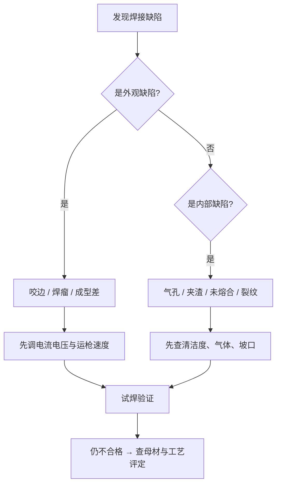

# 常见焊接缺陷有哪些？气孔、飞溅、咬边的成因与对策

> **一句话结论**：多数焊接缺陷不是设备问题，而是**参数匹配、母材清洁度、气路状态**三者之一出了偏差。按"现象 → 成因 → 当场调整"的顺序排查，通常能在几分钟内解决。

## 缺陷排查总思路

## 一、气孔

**现象**：焊缝表面或内部出现圆形孔洞，密集成蜂窝状。

| 成因 | 判别特征 | 对策 |
|------|---------|------|
| 保护气体不足 | 气孔集中且均匀分布 | 气保焊流量调至 15–20L/min；TIG 调至 6–12L/min |
| 气路漏气/堵塞 | 突发性大量气孔 | 检查气管、减压流量计、喷嘴是否堵塞 |
| 母材有油、锈、水 | 气孔集中在特定区域 | 焊前打磨清理至金属光泽 |
| 焊条受潮 | 手工焊常见，手工焊条未烘干 | 碱性焊条按说明烘干（通常 350℃×1h） |
| 风速过大（气保焊） | 户外作业时出现 | 加挡风屏，或改用抗风工艺 |
| 收弧弧坑 | 焊缝末端气孔 | 使用收弧电流衰减功能 |

## 二、飞溅大

**现象**：熔滴爆裂，焊渣飞散附着在工件表面。

| 成因 | 对策 |
|------|------|
| 电压偏低 | 适当提高电压（气保焊） |
| 电流偏高 | 降低电流至合适区间 |
| 电感不匹配 | 调整电感档位（有该功能的机型） |
| 极性接反 | 气保焊须用直流反接（DCEP） |
| 母材有锈、油 | 焊前清理 |
| 气体纯度不足 | 更换合格气体 |

> **气保焊飞溅的实用建议**：CO₂ 保护本身飞溅就比混合气大。若外观要求高，改用 80%Ar+20%CO₂ 混合气，飞溅可明显减少。

## 三、咬边

**现象**：焊缝与母材交界处被电弧"挖"出凹陷槽。

| 成因 | 对策 |
|------|------|
| 电流过大 | 降低电流 |
| 电弧电压过高、弧长过长 | 压低电弧，缩短弧长 |
| 运枪速度过快 | 减慢焊接速度 |
| 焊条角度不当 | 调整至正确倾角（手工焊通常 70°–80°） |
| 焊枪偏向一侧 | 保持对准焊缝中心 |

## 四、未熔合与未焊透

**现象**：焊缝金属与母材之间或层间没有完全熔合；根部未焊透。

| 成因 | 对策 |
|------|------|
| 电流偏小 | 提高电流 |
| 焊接速度过快 | 放慢速度，保证熔池充分 |
| 坡口角度不足或钝边过厚 | 修正坡口尺寸，减小钝边 |
| 装配间隙不当 | 按工艺规定控制间隙 |
| 层间清渣不彻底 | 每道焊后彻底清渣再焊 |

## 五、焊瘤

**现象**：焊缝边缘出现多余突出的金属堆积。

| 成因 | 对策 |
|------|------|
| 电压偏低 | 提高电压 |
| 焊接速度过慢 | 加快运枪 |
| 电流偏大 | 降低电流 |
| 立焊/仰焊位置运枪不当 | 采用正确的运条手法，控制熔池体积 |

## 六、裂纹

**现象**：焊缝或热影响区出现裂缝，属最严重的缺陷。

| 类型 | 成因 | 对策 |
|------|------|------|
| 热裂纹 | 硫磷杂质偏高、焊缝成形系数过小 | 控制母材与焊材成分，调整焊缝形状 |
| 冷裂纹（延迟裂纹） | 氢致开裂，常见于高强钢 | 焊条烘干、焊前预热、焊后缓冷、及时后热 |
| 弧坑裂纹 | 收弧过快未填满 | 使用收弧衰减、回焊法填满弧坑 |
| 拘束裂纹 | 结构刚性过大 | 合理设计焊接顺序、控制层间温度 |

> **重要**：出现裂纹须**彻底清除后重焊**（打磨或碳弧气刨到裂纹末端之外），绝不能直接覆盖焊接。

## 预防胜于补救：焊前必做四件事

| 序号 | 动作 | 说明 |
|------|------|------|
| 1 | 清理母材 | 油、锈、水、漆全部清除至金属光泽（不锈钢与铝尤其重要） |
| 2 | 烘干焊材 | 碱性焊条必须按说明烘干，用保温筒随用随取 |
| 3 | 核对参数 | 按板厚与位置设定电流、电压、气流量 |
| 4 | 检查设备 | 气路密封、喷嘴与导电嘴磨损、地线接触良好 |

## 常见问题（FAQ）

### Q1：气孔是设备坏了还是操作问题？

多数是操作或耗材问题。判别顺序：**先查母材清洁度 → 再查气路与流量 → 最后查焊材是否受潮**。如果同一台机器换材料后气孔消失，说明设备本身没问题。

### Q2：户外风大时气保焊一定要停吗？

风速超过约 2m/s 时保护气体容易被吹散，气孔率显著上升。处理方式：加挡风屏/挡风棚；或改用**药芯焊丝**（自带造气保护，抗风性好），或改用手工焊。

### Q3：不锈钢焊缝发黑是什么原因？

通常是**热输入过大或保护不良**（氧化）。对策：降低电流、提高焊接速度、加大氩气保护（必要时用背面保护气）。轻微发黑可通过酸洗钝化处理，严重氧化会影响耐蚀性。

### Q4：焊缝成型忽好忽坏，找不到规律？

重点检查三个"漂移源"：① 送丝是否稳定（气保焊）；② 气流量是否波动；③ 电网电压是否稳定（电压波动会直接改变输出电流）。建议逐个固定变量做试板对比。

**有具体的焊接质量问题要排查？** 描述母材、板厚、工艺和现象，最好附上焊缝照片，发至 **mfujun@agent.qq.com** 或在[联系页面](/contact)留言。

