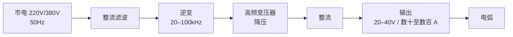
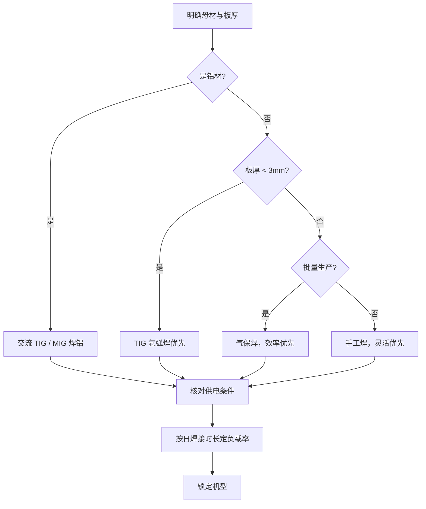

# 电焊机完全指南：原理、类型、参数、场景、保养与趋势

> **一句话结论**：电焊机的本质是**一台受控的大电流电源**——它把市电变换成适合电弧稳定的低电压大电流输出。看懂它的原理，参数表就不再是天书；选型、使用、保养的绝大多数问题，都能从这五个字里找到答案：**电流、电压、负载率**。

这篇文章按五个层次展开：先讲清它怎么工作，再梳理有哪些类型，然后是参数与选购、场景与操作、保养与排故，最后看行业往哪走。可以顺序读，也可以直接跳到您关心的部分。

## 一、基本原理：电焊机到底在干什么

### 焊接的物理本质

电弧焊利用的是**电弧放电产生的热量**。当焊条（或焊丝）与工件之间建立起电弧，电弧中心的温度可达 **6000℃ 以上**，远超钢铁 1500℃ 左右的熔点，于是母材与焊材同时熔化、凝固，形成冶金结合的焊缝。

要让这个过程稳定，需要同时满足三个条件：

| 条件 | 作用 | 对应设备设计 |
|------|------|-------------|
| 稳定持续的电弧 | 提供热源 | 具备**陡降外特性**的电源 |
| 合适的电流密度 | 控制熔深与熔敷率 | 电流可调、波动小 |
| 可控的过渡形式 | 决定飞溅与成形 | 波形控制（如脉冲、短路过渡） |

### 为什么必须"降压增流"

这是电焊机最核心的设计逻辑，也是最容易被忽略的一点。

市电是 **220V/380V 的高压小电流**，而焊接需要的是 **20–40V 的低压大电流**（电流可达数百安培）。两者功率相当，但形态完全不同。电焊机内部的变压器/逆变电路，做的就是这件事：**把电压降下来，把电流升上去**。

原因在于：电弧在低压下才能稳定维持，而高电压反而会破坏电弧的稳定性；同时大电流才能提供足够的熔深与熔敷效率。

### 外特性：电焊机与普通电源的根本区别

普通电源追求"电压恒定"，电焊机恰恰相反，它需要**陡降外特性**：

| 特性类型 | 电压随电流的变化 | 适用场景 |
|---------|----------------|---------|
| 平特性 | 基本不变 | 气保焊（MIG/MAG）、埋弧焊 |
| **陡降特性** | 电流增大时电压**明显下降** | 手工焊（MMA）、TIG |

为什么手工焊需要陡降？因为**电弧长度由人手控制，天然会波动**。陡降特性使得电弧长度轻微变化时，电流变化很小（电流自调节作用），从而保证熔深均匀、不易断弧。这也解释了为什么手工焊对"手稳"的要求没那么苛刻——设备在帮您兜底。

### 从工频到逆变：一次技术迭代

传统工频焊机直接用 50Hz 变压器降压，**铁芯体积大、重量重、能耗高**。逆变焊机先把 50Hz 整流成直流，再逆变成 **20–100kHz 的高频**——频率提高后，变压器铁芯可以做得极小。

这就是为什么：

| 对比项 | 传统工频机 | 逆变焊机 |
|-------|-----------|---------|
| 重量 | 重（数十公斤） | **轻（3–10kg 常见）** |
| 效率 | 约 60–70% | **约 85–90%** |
| 电流稳定性 | 一般 | 好（响应快） |
| 功能扩展 | 难 | 易（脉冲、双脉冲、数字化） |
| 维修 | 结构简单易修 | 需专业维修 |

**结论**：除特殊大功率场合外，逆变机已是绝对主流。选购时不必纠结"要不要逆变"，而应关注**逆变方案的质量**（见第三节）。

## 二、主要类型：五大机型的定位与差异

电焊机按工艺可分为五大门类，它们的差异远不止"贵贱"之分，而是**服务完全不同的工况**。

### 2.1 手工电弧焊机（MMA / 焊条焊）

最基础、最通用的类型。

- **原理**：焊条既是电极又是填充材料，药皮在高温下分解产生保护气体和熔渣
- **优点**：设备便宜、适应性强、户外有风也能焊、焊条便宜易得
- **缺点**：效率低、焊缝质量依赖手艺、需清渣、不宜薄板
- **典型场景**：维修、户外施工、钢结构现场、管道

> **适用判断**：活杂、量小、环境恶劣 → 手工焊是首选。它的"糙"恰恰是它的优势。

### 2.2 二氧化碳气体保护焊机（MIG/MAG）

生产效率的代表，加工厂主力机型。

- **原理**：焊丝连续送进，CO₂ 或混合气体保护熔池
- **优点**：**效率高**（连续送丝，无需换焊条）、熔深大、易上手、适合长时间作业
- **缺点**：需气瓶、怕风（需挡风）、设备与耗材成本较高、飞溅较多（可优化）
- **典型场景**：钢结构、钣金、汽车制造、批量生产

### 2.3 氩弧焊机（TIG）

质量与美观的代表。

- **原理**：钨极不熔化，只产生电弧，填充丝另加；氩气保护
- **优点**：**焊缝质量最优**、成形美观、热输入可控、适合薄板与精密件
- **缺点**：效率低、成本高、对清洁度要求苛刻、需一定技巧
- **典型场景**：不锈钢、铝、管道打底、食品与医药设备

> **关键区别**：焊铝**必须用交流 TIG**（或 MIG 焊铝）。直流 TIG 无法破除铝表面的氧化膜，焊不上。

### 2.4 等离子切割机

严格说不是焊机，但常与焊机配套出现（下料工序）。

- **原理**：压缩电弧形成高温等离子束，熔化并吹走金属
- **优点**：切割速度快、切面整齐、可切不锈钢与铝（氧乙炔难以胜任）
- **缺点**：需压缩空气、耗材（电极/喷嘴）消耗快、烟尘大
- **典型场景**：金属下料、拆解、开孔

### 2.5 多功能一体机与便携机

近年增长最快的品类。

- **多功能机**：一台机器集成 MMA + TIG + 气保焊等，适合空间有限的小作坊
- **便携机**：重量 3–5kg，多为 220V 输入，适合流动维修、家庭

> **取舍**：一体机的"全能"通常意味着**每项都不如专用机**。若某道工序占您 80% 的工作量，仍建议买专用机。

### 五类机型横向对比

| 机型 | 效率 | 焊缝质量 | 上手难度 | 设备成本 | 运行成本 | 代表场景 |
|------|------|---------|---------|---------|---------|---------|
| 手工焊 MMA | 中 | 中 | 低 | 低 | 低 | 维修、户外 |
| 气保焊 MIG/MAG | **高** | 良 | 中 | 中 | 中 | 加工厂批量 |
| 氩弧焊 TIG | 低 | **优** | 高 | 中高 | 高 | 不锈钢、精密件 |
| 等离子切割 | — | — | 中 | 中 | 中 | 下料 |
| 一体机/便携机 | 视配置 | 视配置 | 低 | 低 | 视配置 | 小作坊、流动 |

## 三、核心技术参数与选购要点

参数表是选型的主战场。以下八项按**重要程度**排序——前四项决定"能不能用"，后四项决定"好不好用"。

### 3.1 额定输出电流与负载持续率（最重要）

这是最容易被混淆、也最容易被虚标的一项。

**负载持续率（暂载率）** 的定义：在标准 10 分钟周期内，设备能连续工作的时间占比。

| 负载持续率 | 10 分钟内可焊 | 适合场景 |
|-----------|-------------|---------|
| 35% | 3.5 分钟 | 家庭、间歇维修 |
| 60% | 6 分钟 | 一般加工厂 |
| 100% | 连续 | 流水线、自动化 |

> **核心避坑**：厂商标称的"最大电流"往往是**最低负载持续率下**的瞬时值。真正该看的是 **"XX A @ 60%"** 这种带条件的标法。一台"额定 60%@200A"的机器，实干活能力胜过"最大 250A"但额定只有"35%@140A"的机器。

**选购建议**：按您的**日实际焊接时长**反推。每天连续焊接超 3 小时 → 选 60% 以上。

### 3.2 输入电压与供电条件

| 现场条件 | 可选机型 | 电流上限 | 注意事项 |
|---------|---------|---------|---------|
| 仅单相 220V | 便携机、小型手工焊机 | 约 200A | 需 16A 以上独立回路、≥2.5mm² 导线 |
| 380V 三相 | 全品类 | 400–500A | 确认空开容量与线径 |
| 临时流动 | 双电压机型 | 视机型 | 220V/380V 切换须按说明书 |

> **常见误判**：以为"有 220V 插座就能用大焊机"。400A 级焊机在 220V 下需 40A 以上输入电流，家用线路带不动，会频繁跳闸甚至损坏设备。

### 3.3 空载电压与电流调节范围

- **空载电压**：引弧能力的关键。通常 50–80V，过低不易起弧，过高有安全风险
- **调节范围**：范围越宽适应性越好，但**注意低端小电流的稳定性**——很多机器标"20–200A"，实际在 30A 以下很不稳定，而薄板恰恰需要小电流

### 3.4 效率与功率因数

| 指标 | 含义 | 参考值 |
|------|------|-------|
| 效率 | 输出功率/输入功率 | 逆变机 85–90% |
| 功率因数 | 有功/视在功率 | 带 PFC 的可达 0.95+ |

**为什么重要**：效率低意味着更费电、发热更多；功率因数低可能被供电部门加收费用，且对发电机供电场景尤其敏感。

### 3.5 焊接工艺与功能配置

| 功能 | 作用 | 谁需要 |
|------|------|-------|
| 脉冲 | 降低热输入，适合薄板与立焊 | 不锈钢薄板、精密件 |
| 双脉冲 | 美观鱼鳞纹，控制热输入 | 铝、对外观要求高 |
| 防粘条 | 防止焊条粘工件 | 新手、手工焊 |
| 热起弧/推力 | 改善引弧与熔深 | 手工焊 |
| VRD 防触电 | 降低空载电压 | 潮湿、高空作业 |

### 3.6 配套件与后续成本

设备只是一部分，配套常被忽略：

| 配套项 | 说明 | 成本量级 |
|--------|------|---------|
| 焊把/焊枪 | 接口需与主机匹配 | 中 |
| 地线夹与电缆 | 截面按电流选，过细会发热 | 低 |
| 气瓶与流量计 | 需按当地规定合规租用存放 | 中 |
| 焊条/焊丝 | 持续消耗 | 持续 |
| 易损件 | 导电嘴、喷嘴、电极 | 持续 |
| 供电改造 | 拉专线的隐性成本 | 视现场 |

### 3.7 品牌与售后

判断要点：

1. 是否**标清额定负载持续率**（虚标重灾区）
2. 是否提供**完整输入/输出参数**
3. 是否有**明确质保条款与本地服务点**
4. 易损件是否好买（决定长期停机成本）

### 3.8 选购决策路径

> 更详细的选型三步法，见[电焊机怎么选](/articles/how-to-choose-welder)。

## 四、常见应用场景与操作注意事项

### 4.1 典型场景与机型匹配

| 场景 | 推荐工艺 | 关键考量 |
|------|---------|---------|
| 钢结构加工厂 | 气保焊为主 | 效率、熔深、连续作业能力 |
| 压力容器与管道 | TIG 打底 + 手工/气保填充 | 质量等级、工艺评定 |
| 汽车维修钣金 | 气保焊（薄板）、点焊 | 低热输入、防变形 |
| 装修与门窗 | 手工焊、小型气保焊 | 便携、220V 可用 |
| 设备维修抢险 | 手工焊 | 环境适应性、抗风 |
| 不锈钢制品 | TIG | 焊缝美观、防氧化 |

### 4.2 操作前的准备与检查

| 检查项 | 要点 |
|-------|------|
| 个人防护 | 面罩（不可用普通墨镜替代）、皮手套、阻燃工装、安全鞋 |
| 环境 | 清除易燃物、备灭火器、通风（尤其镀锌与涂装件） |
| 设备 | 电缆无破损、接头紧固、接地可靠 |
| 参数 | 按板厚与工艺预设电流，先试焊再正式作业 |
| 工件 | 清除油污、锈迹、水分（影响气孔与飞溅） |

### 4.3 关键操作要点

**引弧**：手工焊推荐**划擦法**（像划火柴），比直击法更易掌握且不易粘条。TIG 需高频引弧或接触引弧。

**电弧长度**：手工焊控制在**焊条直径的 0.5–1 倍**。过长会导致电弧不稳、飞溅大、保护变差；过短易粘条、熔深不足。

**运条角度与速度**：

| 参数 | 建议 | 影响 |
|------|------|------|
| 前倾角 | 10–20°（左向焊） | 影响熔深与成形 |
| 运条速度 | 匀速 | 过快熔深不足，过慢烧穿/变形 |
| 摆动 | 按焊缝宽度定 | 影响焊缝饱满度 |

**热输入控制**：板越薄，越要控制热输入（降低电流、加快速度、用脉冲）。这是**控制变形与烧穿**的核心。

### 4.4 安全红线

> ⚠️ **以下几条没有商量余地**：
>
> 1. **必须使用合格面罩**——弧光中的紫外线可致电光性眼炎，普通墨镜毫无防护作用
> 2. **密闭空间作业必须强制通风**——焊接烟尘含金属氧化物，长期吸入危害显著
> 3. **镀锌、涂装、含铅件**焊接会产生有毒烟尘，必须佩戴呼吸防护
> 4. **气瓶必须立放固定**，远离热源与明火，搬运时戴安全帽
> 5. **焊接电缆与气瓶不得混放**，防止电弧引燃
> 6. **潮湿环境与高空作业**应使用带 VRD 防触电功能的设备

## 五、日常保养与常见故障排查

### 5.1 保养周期表

| 周期 | 项目 | 要点 |
|------|------|------|
| 每次使用后 | 清洁机身、整理电缆 | 清除粉尘，避免电缆折损 |
| 每周 | 检查接头与电缆 | 紧固松动端子，检查绝缘破损 |
| 每月 | 清理内部积尘 | **压缩空气吹扫**（注意防静电与粉尘） |
| 每季度 | 检查风扇与散热 | 风扇是逆变机的生命线，转速异常须及时处理 |
| 每年 | 专业检修 | 检测绝缘、检查电容与功率器件 |

> **逆变机的头号杀手是"热"和"尘"**。散热通道堵塞会导致功率器件过热保护甚至烧毁。凡是长期在多尘环境使用的设备，清理周期应缩短一半。

### 5.2 常见故障速查

| 现象 | 可能原因 | 排查方向 |
|------|---------|---------|
| 不起弧 | 焊条受潮、空载电压不足、地线接触不良 | 先换干燥焊条，再查地线与接头 |
| 频繁断弧 | 电流过小、电弧过长、输入电压不稳 | 提高电流，缩短弧长，测输入电压 |
| 焊条粘工件 | 电流过小、起弧手法不当 | 提高电流，改用划擦法引弧 |
| 焊缝有气孔 | 母材有油污/锈/水、保护气不足、焊材受潮 | 清洁母材，检查气路与流量 |
| 飞溅特别大 | 电流过大、极性接反、气体不纯 | 调整电流，核对极性，检查气体 |
| 熔深不足 | 电流小、速度过快、极性错误 | 提高电流，减慢速度 |
| 烧穿/变形大 | 电流过大、速度过慢、收弧不当 | 降低电流，提高速度，用脉冲 |
| 焊缝有裂纹 | 母材碳当量高、冷速过快、未预热 | 预热、控制层间温度、选合适焊材 |
| 过热保护频繁 | 散热堵塞、负载超过额定率、环境温度高 | 清灰、降低负载率、改善通风 |
| 开机无反应 | 供电、空开、内部保险 | 先查外部供电，再送修 |

> **排查原则**：**先外后内、先简后繁**。绝大多数"设备故障"其实是**焊材受潮、接头松动、母材不洁、参数不当**这四类外部原因。在拆机之前，先把这四项排除掉。

### 5.3 延长寿命的四个习惯

1. **不超负载率使用**——这是最伤设备的行为，也是保修除外条款的常见项
2. **保持散热通畅**——不遮挡进风口，定期吹灰
3. **规范存放**——干燥环境，焊条密封防潮，气瓶合规存放
4. **定期专业检修**——尤其大功率设备，预防性维护远便宜于停机损失

## 六、行业发展趋势

### 6.1 数字化与智能化

传统焊机靠旋钮调参，新一代设备开始引入**数字控制与参数记忆**：

- 工艺参数一键调用，降低对操作经验的依赖
- 实时监测电流电压，异常自动报警
- 部分机型支持数据记录，便于质量追溯

### 6.2 逆变技术持续深化

逆变已是主流，当前的迭代方向是：

| 方向 | 价值 |
|------|------|
| 更高开关频率 | 更小体积、更快动态响应 |
| 碳化硅（SiC）器件 | 更高效率、更好耐温性 |
| 数字化波形控制 | 飞溅更少、成形更佳 |

### 6.3 自动化与机器人焊接

在批量制造领域，焊接机器人持续渗透。对普通用户的影响是间接但真实的：

- 人工焊接岗位向上迁移（操作与调试，而非纯手工）
- 对**焊接质量一致性**的要求整体提高
- 焊接工艺知识的重要性上升

### 6.4 绿色化与能效要求

- 能效标准趋严，低效工频机逐步退出
- 带 PFC 的机型因功率因数高而更受青睐
- 焊接烟尘治理在环保法规下日益受到重视

### 6.5 对新购机者意味着什么

| 趋势 | 对选购的实际影响 |
|------|----------------|
| 逆变普及 | 不必为"逆变"付溢价，重点是品质 |
| 数字化 | 中高端机型受益，低端仍以性价比为主 |
| 能效要求 | 优先选高功率因数机型，长期省电 |
| 自动化 | 小作坊暂无需考虑，批量生产应提前规划 |

> **给多数用户的判断**：设备本身的技术已相当成熟，**同价位机型的实际差距主要在品控与售后**，而非参数表上的数字。与其追逐"最新技术"，不如把预算放在**额定参数扎实、售后可靠**的机型上。

## 常见问题（FAQ）

### Q1：家用电焊机应该怎么选？

优先确认三点：**单相 220V 供电**、**板厚通常 2–6mm**、**使用频率低**。对应选择 200A 级逆变手工焊机即可，重量轻、易收纳。若偶尔要焊不锈钢薄板，可选带 TIG 功能的双用机。

### Q2：逆变焊机真的比工频机耐用吗？

**不能一概而论**。逆变机的优势是效率和功能，但**元件更精密、对散热更敏感**。在粉尘大、散热差的环境里，一台做工扎实的工频机可能比廉价逆变机更耐用。关键看散热设计与品控。

### Q3：为什么同样的机型，别人焊得好我焊不好？

焊接质量 = **设备 + 焊材 + 参数 + 手法**。设备只占一部分。建议按顺序排查：焊材是否受潮 → 电流是否合适 → 电弧长度是否稳定 → 母材是否清洁。多数"焊不好"出在参数与清洁度上，而非设备。

### Q4：焊机放久了会坏吗？

会。长期不用需注意：**存放在干燥环境**（防潮防锈）、**定期通电运行**（防止电容老化）、**焊条密封保存**。存放超过一年建议送检后再投入使用。

### Q5：日常保养最省钱的一件事是什么？

**定期清理散热通道**。这一步几乎零成本，却能规避逆变机最常见的过热保护与器件烧毁。多尘环境建议每两周吹扫一次。

**需要按您的具体工况选型建议？** 把母材材质、板厚、供电条件、日焊接量与预算区间发到 **mfujun@agent.qq.com**，或在[联系页面](/contact)留言，我们会结合[产品参数](/products/)给出可执行的建议。

