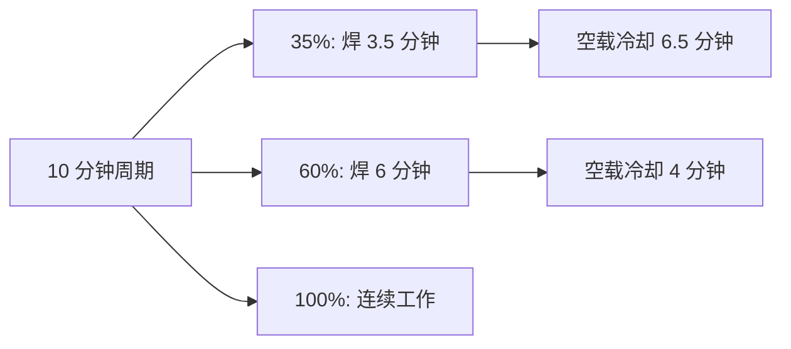

# 电焊机参数怎么看？额定电流、负载持续率、空载电压详解

> **一句话结论**：判断一台焊机真实能力，只看**额定负载持续率下的输出电流**。参数表里的"最大电流"通常是短时峰值，不能作为干活能力的依据。

## 必看的五个核心参数

| 参数 | 含义 | 为什么重要 |
|------|------|-----------|
| 额定输入电压 | 焊机工作所需电源（220V/380V） | 决定能不能在现场用 |
| 额定输入容量 | 输入功率，kVA 计 | 决定配电线路与空开容量 |
| 输出电流范围 | 可调节的焊接电流区间 | 决定能焊多厚的板、多粗的焊条 |
| **额定负载持续率** | 10 分钟周期内可工作的时间占比 | **区分真实能力的关键** |
| 空载电压 | 未焊接时的输出电压 | 影响引弧难易与安全 |

## 负载持续率：最被低估的参数

**定义**：负载持续率（Duty Cycle）= 在 10 分钟为一个周期内，焊机可连续输出额定电流的时间比例。

**为什么它最重要**：负载持续率与输出电流是**联动关系**——同一台机器，负载持续率越高，对应的可输出电流越低。

举例说明同一台焊机的两种标注方式：

| 标注方式 | 电流 | 负载持续率 | 实际含义 |
|---------|------|-----------|---------|
| 峰值标注 | 250A | 35% | 只能在 3.5 分钟内达到 250A |
| 额定标注 | 180A | 100% | 可长时间稳定输出 180A |

这两者来自**同一台机器**。宣传页往往只写前者，因为数字更好看。**买之前要问清的是后者。**

## 电流范围与焊条匹配

| 焊条直径 | 参考电流区间 | 适用板厚 |
|---------|-------------|---------|
| 1.6mm | 30–60A | 0.8–2mm |
| 2.0mm | 50–80A | 1.5–3mm |
| 2.5mm | 70–110A | 2–4mm |
| 3.2mm | 100–150A | 4–8mm |
| 4.0mm | 140–200A | 6–12mm |
| 5.0mm | 180–260A | 10mm 以上 |

> **要点**：机器标称"可用 5.0mm 焊条"，往往是在**最低负载持续率**下才能实现。若需要长期用粗焊条作业，应优先看该焊条直径对应的**额定负载持续率**。

## 空载电压：影响引弧与安全

| 空载电压区间 | 特点 | 适用 |
|-------------|------|------|
| 50–60V | 引弧稍难，安全性好 | 家用小型机 |
| 60–80V | 引弧顺畅，主流区间 | 手工焊机常见 |
| 250V 以上 | 等离子切割机典型值 | 需严格绝缘防护 |

**安全提醒**：空载电压越高，触电风险越大，潮湿环境作业风险显著上升。带 **VRD（防触电装置）** 的机型会把空载电压降到安全值，是潮湿或金属容器内作业的安全保障。

## 其他易被忽略的参数

| 参数 | 说明 |
|------|------|
| 效率（%） | 逆变机型通常 ≥85%，越高越省电、发热越小 |
| 功率因数 | 影响电网负担，被动式约 0.7，主动 PFC 可 >0.95 |
| 防护等级（IP） | IP21S 室内用，IP23 以上可户外使用 |
| 绝缘等级（F/H） | 决定允许温升，H 级耐受温度更高 |
| 整机重量 | 逆变机型重量差异大，与散热设计和用料相关 |
| 保护功能 | 过热、过流、过压、缺相保护，以及防粘条功能 |

## 识别虚标电流的三个方法

1. **看是否标注负载持续率**：只写"最大电流 XXX A"而全程不提负载持续率，大概率是峰值标注。
2. **算输入容量是否匹配**：输出 200A、效率 85% 的手工焊机，输入容量约 5–7 kVA。若标称"220V 输入、输出 315A"，简单核算就知道不成立——220V/16A 插座最多提供约 3.5kVA。
3. **看整机重量与散热设计**：相同功率下重量异常轻、散热片面积明显偏小的，长期高负载能力存疑。

## 常见问题（FAQ）

### Q1：负载持续率 60% 是不是意味着焊 6 分钟必须停 4 分钟？

不完全是硬性要求，但**超过这个比例会触发过热保护**。实际作业中"焊一段、清渣、调位置、对缝"的间歇动作通常能自然满足冷却。只有在**长时间连续满负荷**作业时才会成为限制。

### Q2：为什么同一台焊机在不同资料里标的电流不一样？

就是因为负载持续率不同。厂商标"最大 XXX A"用的是低负载持续率数据，标"额定 XXX A"用的是 100% 或 60% 数据。两者都对，但含义完全不同。

### Q3：输入容量要在配电上留多少余量？

建议焊机额定输入容量不超过**配电回路容量的 70%**，给同时运行的其他设备留余量。例如焊机输入 7kVA，建议配 10kVA 以上容量的独立回路。

### Q4：空载电压高好还是低好？

各有取舍。空载电压高，引弧更容易、电弧更稳定；但触电风险也随之上升。正常环境优先选 60–80V 的主流区间；潮湿环境、金属容器内作业应选带 VRD 的机型。

**拿到一份参数表不确定怎么看？** 把参数截图或型号发到 **mfujun@agent.qq.com**，或在[联系页面](/contact)留言，我们帮您核算真实能力。

