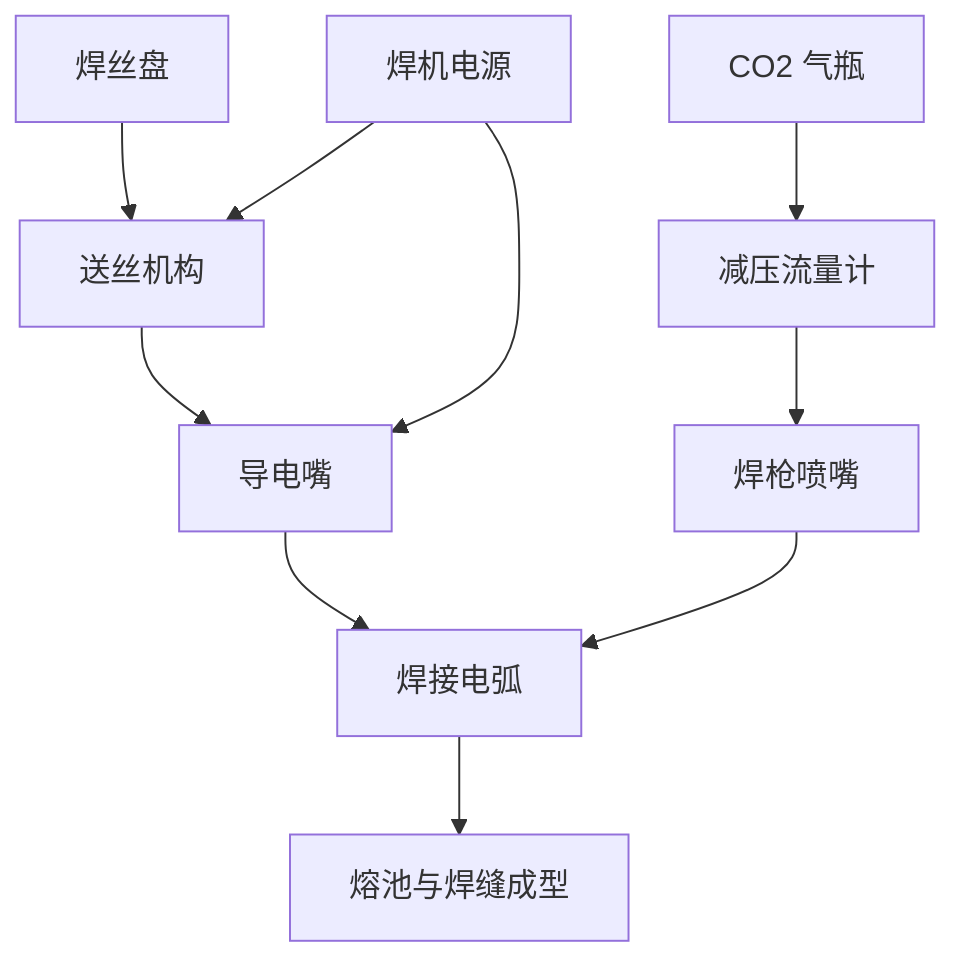

# 二氧化碳气保焊机（MIG/MAG）

> **一句话结论**：二氧化碳气保焊熔敷效率是手工焊的 2–3 倍，是加工厂批量焊接中厚板的主力机型，适合 3mm 以上碳钢的连续作业。

## 什么是二氧化碳气保焊机

气保焊（MIG/MAG）用连续送进的焊丝作电极，靠 CO₂ 或混合气体保护熔池，无需更换焊条、无需清渣。**焊接效率高、焊缝成型好、易实现半自动化**，是中小加工厂最常见的生产型设备。

## 工作原理

## 典型技术参数

| 参数项 | 参考范围 | 说明 |
|--------|---------|------|
| 额定输入电压 | 三相 380V（部分双电压） | 大功率机型必须三相 |
| 额定输入容量 | 8–25 kVA | 与电流等级正相关 |
| 输出电流范围 | 200–500A | 覆盖 0.8–1.6mm 焊丝 |
| 额定输出电压 | 20–40V | 随电流变化 |
| 额定负载持续率 | 60%–100% | 生产型设备建议 60% 以上 |
| 适用焊丝直径 | 0.8 / 1.0 / 1.2 / 1.6mm | 薄板用细丝，厚板用粗丝 |
| 适用板厚 | 3–20mm（多层多道） | 厚板需开坡口 |
| 保护气体 | CO₂ / 80%Ar+20%CO₂ 混合气 | 混合气飞溅更小、成型更美观 |
| 送丝方式 | 一体式 / 分体式 | 分体式焊枪更轻便、适合长距离 |

## 适用场景

- **钢结构加工厂**：中厚板的批量组焊，效率优先
- **金属家具与货架制造**：连续角焊缝、点焊定位
- **汽车维修与改装**：车身钣金、底盘结构件焊接
- **农机与工程机械**：结构件修复与加强
- **容器与管道**：配合坡口工艺完成多层多道焊

## 选购要点

1. **按日焊接量定负载持续率**：连续生产选 60%–100% 机型，间断作业 35%–40% 即可。
2. **送丝系统是关键**：送丝稳定性直接决定焊接质量，优先选四轮驱动送丝机构。
3. **焊枪长度与分体设计**：作业范围大时选分体式，焊枪更轻、操作更灵活。
4. **气体配置要一起规划**：气瓶、减压流量计、气路管需同步配齐，气瓶需按当地规定合规租用与存放。
5. **是否需要双脉冲/脉冲功能**：焊接薄板或追求美观成型时，脉冲气保焊优势明显。
6. **防风措施**：气保焊对风敏感（风速 >2m/s 会影响保护效果），户外作业需加挡风屏。

## 常见焊接缺陷与对策

| 缺陷 | 常见原因 | 对策 |
|------|---------|------|
| 气孔 | 气体流量不足、喷嘴堵塞、母材有油锈 | 调整流量至 15–20L/min，清理喷嘴与母材 |
| 飞溅大 | 电压偏低、电流偏高、电感不匹配 | 微调电压/电流，调整电感（如有） |
| 咬边 | 电流过大、运枪速度过快 | 降低电流，控制摆动与行走速度 |
| 未熔合 | 电流偏小、坡口角度不足 | 提高电流，修正坡口与装配间隙 |
| 焊瘤 | 电压偏低、行走过慢 | 提高电压，加快运枪 |

## 使用与维护要点

| 项目 | 频次 | 做法 |
|------|------|------|
| 清理导电嘴、喷嘴飞溅 | 每班次 | 用专用防溅剂与清理工具，保持送丝顺畅 |
| 检查送丝轮与导管 | 每周 | 磨损超限更换，防止送丝不稳 |
| 检查气路密封 | 每周 | 查漏气、确认流量计读数正常 |
| 清理焊机内部积灰 | 每 1–2 个月 | 断电吹扫，注意电容放电 |
| 检查接地与线缆 | 每月 | 紧固端子、检查线缆破损 |

> **安全提示**：CO₂ 气瓶须直立固定存放、避免暴晒与撞击；密闭空间作业须检测氧含量并强制通风（CO₂ 泄漏会置换氧气）。

## 常见问题（FAQ）

### Q1：气保焊和手工焊的成本差多少？

按熔敷效率算，气保焊的综合焊接成本通常低于手工焊 30%–50%，主因是焊丝单价低于焊条、且无焊条头损耗、无需反复清渣。但前提是**产量足够**——小批量零星作业时，气瓶与设备投入摊薄不下来。

### Q2：CO₂ 和混合气（Ar+CO₂）选哪个？

CO₂ 便宜，但飞溅较大、成型稍差；80%Ar+20%CO₂ 混合气飞溅小、成型美观、适合对外观有要求的场合。成本上混合气更高。加工厂普遍用 CO₂ 打底、混合气收面。

### Q3：气保焊能焊不锈钢吗？

可以，用不锈钢焊丝 + 混合气（如 98%Ar+2%CO₂ 或三元混合气）。但注意：**不能用纯 CO₂ 焊不锈钢**，会导致渗碳、耐蚀性下降。

### Q4：风大的户外为什么焊不好？

保护气体被吹散后，熔池失去保护会大量产生气孔。风速超过约 2m/s 就会明显影响。户外作业必须加挡风屏，或改用抗风性更好的手工焊、药芯焊丝。

**需要配套气保焊整套配置（含气瓶、焊枪、送丝机构）？** 写明板厚、日产量与车间供电条件，发至 **mfujun@agent.qq.com** 或在[联系页面](/contact)留言。

