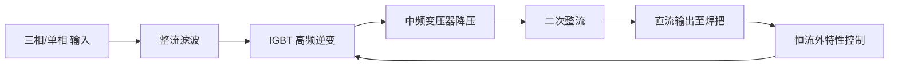

# 逆变直流手工焊机（MMA）

> **一句话结论**：逆变直流手工焊机是适配范围最广、上手门槛最低的机型，适合钢结构、管道、设备维修等绝大多数碳钢焊接场景，也是首次采购焊接设备的稳妥选择。

## 什么是逆变直流手工焊机

逆变手工焊机（MMA，Manual Metal Arc）通过 IGBT 逆变技术把工频交流电转换为高频直流，再输出稳定的直流焊接电流。相比老式交流焊机，它**重量更轻、电弧更稳、能耗更低**，且直流输出能用碱性焊条（如 J507），这是交流机做不到的。

## 工作原理

## 典型技术参数

| 参数项 | 参考范围 | 说明 |
|--------|---------|------|
| 额定输入电压 | 单相 220V / 三相 380V | 三相机型电流上限更高、电弧更稳 |
| 额定输入容量 | 5–20 kVA | 需与供电线路容量匹配 |
| 输出电流范围 | 120–500A | 覆盖 2.0–5.0mm 焊条 |
| 空载电压 | 60–80V | 影响引弧难易度，过高需注意安全 |
| 额定负载持续率 | 35%–60% | 决定可连续焊接时长 |
| 适用焊条直径 | 2.0 / 2.5 / 3.2 / 4.0 / 5.0mm | 按板厚与坡口选择 |
| 适用板厚 | 1.5–20mm（多层多道） | 厚板需开坡口、多层焊 |
| 效率 | ≥ 85% | 逆变机型优势项 |
| 防护等级 | IP21S–IP23 | 户外作业选防护更高者 |

## 适用场景

- **钢结构与厂房建设**：H 型钢、檩条、支架的现场焊接
- **管道安装与维修**：水暖管道、工艺管道的对接与补焊
- **设备检修**：机械底座、护栏、料架的焊补
- **户外作业**：抗风性好，不依赖气瓶，适合无遮蔽环境
- **应急抢修**：单机独立工作，无送丝/供气系统故障点

## 选购要点

1. **看额定输出而非峰值**：标注"最大电流 400A"可能仅在极低负载持续率下成立，重点看额定负载持续率对应的电流。
2. **确认输入电源条件**：220V 机型适合无三相电的场所；有 380V 条件时优先选三相机，电弧更稳、上限更高。
3. **按最大板厚选型号**：需经常焊 10mm 以上板材时，选 400A 级以上；家用与轻修选 200A 级即可。
4. **关注引弧性能**：带"引弧电流可调"或"热引弧"功能的机型，起弧成功率明显更好。
5. **配件通用性**：确认焊把接口规格（多为 35–50 平方快插），避免后期配件难配。

## 使用与维护要点

| 项目 | 频次 | 做法 |
|------|------|------|
| 清理内部积灰 | 每 1–2 个月（多粉尘环境） | 断电后用干燥压缩空气吹扫，风道保持通畅 |
| 检查接线端子 | 每月 | 紧固输入输出端子，防止接触电阻过大发热 |
| 检查电缆 | 每月 | 查看焊把线与地线有无破皮、接头氧化 |
| 检查散热风扇 | 每季度 | 确认转动正常、无异响、无卡阻 |
| 长期停用 | 每季度 | 通电空载运行 10 分钟，驱潮 |

> **安全提示**：焊接作业须佩戴面罩、防护手套与阻燃工作服；在潮湿环境或金属容器内作业须加强绝缘与通风；焊接前清理作业区易燃物。

## 常见问题（FAQ）

### Q1：逆变焊机为什么比老式交流焊机轻这么多？

因为逆变技术先把工频电提到 20kHz 以上高频，变压器体积与重量随频率上升而大幅下降。同样 400A 输出，逆变机重量可只有老式机的 1/5 到 1/10。

### Q2：手工焊机能焊不锈钢吗？

可以，但要用不锈钢专用焊条（如 A102、A302），且直流反接。不过不锈钢薄板焊接更推荐 TIG 氩弧焊，成型更美观、热输入更易控制。相关内容见[氩弧焊机](/products/tig)。

### Q3：负载持续率 35% 是什么意思，能连续焊多久？

按 10 分钟为一个周期，35% 意味着可连续焊接 3.5 分钟，剩余 6.5 分钟需空载冷却。实际作业中通常"焊一会儿、清渣一会儿"，多数维修场景够用；流水线连续作业需选 60% 或 100% 机型。

### Q4：220V 家用条件下能用 400A 焊机吗？

不建议。400A 级机型在 220V 下通常需要 40A 以上输入电流，家用线路（一般 16A 插座、2.5mm² 线）承受不了，会频繁跳闸并损坏设备。家用场景建议选 200A 级 220V 专用机型。

**需要按具体工况匹配机型？** 把母材材质、板厚、供电条件和日焊接量发到 **mfujun@agent.qq.com**，或在[联系页面](/contact)留言，我们会给出对应的电流区间与机型建议。

