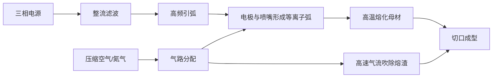

# 等离子切割机

> **一句话结论**：等离子切割机用于导电金属的下料，切割碳钢、不锈钢、铝、铜均可，是焊接生产链条中「下料—成型—焊接」的前道关键设备。

## 什么是等离子切割机

等离子切割利用高温等离子弧（温度可达 15000–30000℃）局部熔化金属并用高速气流吹除熔融物，实现对导电金属的高效切割。相比火焰切割，它能**切不锈钢和铝**（火焰切割做不到），且热影响区小、切口质量好。

## 工作原理

## 典型技术参数

| 参数项 | 参考范围 | 说明 |
|--------|---------|------|
| 额定输入电压 | 三相 380V（小机型可 220V） | 功率越大越需三相 |
| 额定输入容量 | 8–30 kVA | 与切割厚度正相关 |
| 额定切割电流 | 40–160A | 手持机常见 40–100A |
| 切割厚度（碳钢） | 10–60mm | 注意区分「质量切割」与「切断」厚度 |
| 切割厚度（不锈钢） | 约为碳钢的 60%–80% | 不锈钢导热差，实际能力略低 |
| 空载电压 | 250–350V | 等离子机空载电压较高，注意绝缘 |
| 额定负载持续率 | 60%–100% | 数控配套建议 100% |
| 切割气体 | 压缩空气 / 氮气 / 氧气 | 空气最经济，氮气切口质量更好 |
| 引弧方式 | 高频引弧 / 接触引弧 | 机用枪多配高频 |

## 适用场景

- **钣金下料**：碳钢板、不锈钢板的直线与曲线切割
- **钢结构加工**：型钢、连接板的快速下料
- **管道切割**：管件切断与开孔
- **维修拆解**：锈蚀螺栓、卡死结构件的切除
- **数控配套**：配切割平台实现自动轮廓切割

## 选购要点

1. **区分「质量切割」与「切断」厚度**：厂商标注的"最大切割 30mm"通常是**切断**厚度（切口粗糙、无质量要求）。有精度要求时按标注值的 50%–60% 选型。
2. **按最常用厚度选**：按日常 80% 的板材厚度选机型，比按最厚那块板选更经济。
3. **气源要配套**：等离子切割耗气量大，需配套足够排量的空压机 + 冷干机 + 过滤装置（**含水含油的空气会迅速消耗电极和喷嘴**）。
4. **手持还是机用**：手持枪适合现场作业；机用枪配切割床效率与一致性更好。
5. **耗材成本要算**：电极与喷嘴是易损件，不同机型的耗材价格和寿命差别较大，长期使用需纳入成本核算。

## 常见问题与对策

| 现象 | 常见原因 | 对策 |
|------|---------|------|
| 切不透 | 电流不足、切割速度过快、喷嘴磨损 | 提高电流、放慢速度、更换喷嘴 |
| 切口挂渣多 | 气压不足、速度不当、板材有锈 | 调整气压至规定值，清理板材 |
| 引弧困难 | 电极烧损、气压过高、引弧间隙不对 | 更换电极、调整气压与间隙 |
| 喷嘴寿命短 | 空气含水含油、气压过高 | 加装冷干机与油水分离器、降压 |
| 切口严重倾斜 | 喷嘴孔磨损不均、割炬不垂直 | 换喷嘴、校正割炬垂直度 |

## 使用与维护要点

| 项目 | 频次 | 做法 |
|------|------|------|
| 检查电极/喷嘴 | 每班次 | 烧损超限立即更换，否则切割质量骤降 |
| 检查气压 | 每班次 | 按机型规定值调整，过低切不透、过高损耗材 |
| 排出气路积水 | 每日 | 空压机储气罐与过滤器排水 |
| 清理机内积灰 | 每 1–2 个月 | 断电吹扫；等离子机内部高压，务必断电并等待电容放电 |
| 检查割炬电缆与气管 | 每月 | 破损立即更换，防止漏气与漏电 |

> **安全提示**：等离子切割产生强紫外线、烟尘与噪声，必须佩戴专用遮光面罩（遮光号高于普通焊接）、防护服与耳塞；切割区域须强制通风；注意飞溅引发火灾。

## 常见问题（FAQ）

### Q1：等离子切割和火焰切割怎么选？

**碳钢厚板、无质量要求、成本敏感** → 火焰切割（设备便宜、耗材是氧气乙炔）。**不锈钢、铝、铜，或需要切口质量** → 等离子切割。火焰切割无法切割不锈钢和铝。

### Q2：为什么刚换的喷嘴很快就烧了？

最常见原因是**压缩空气含水含油**。空气中的水分和油会在电弧高温下造成电极急剧氧化烧损。必须配套冷干机和精密过滤器，并每日排出储气罐积水。

### Q3：60A 的机器能切多厚？

以碳钢为例，60A 机型通常标注"最大切断 20mm"左右，但**有质量要求的切割厚度一般在 10–12mm 以内**，超过这个厚度切口会明显挂渣、倾斜。选型时按实际质量要求留余量。

### Q4：等离子切割的耗材多久换一次？

电极与喷嘴属于易损件，寿命取决于切割电流、材料厚度、切割时长与气源质量。气源净化做得好时，一套耗材可持续使用数小时到数十小时切割时间；气源差时可能几十分钟就得更换。

**需要下料+焊接的整套设备配置方案？** 写明板材材质、厚度、日常切割量，发至 **mfujun@agent.qq.com**，或在[联系页面](/contact)留言。

