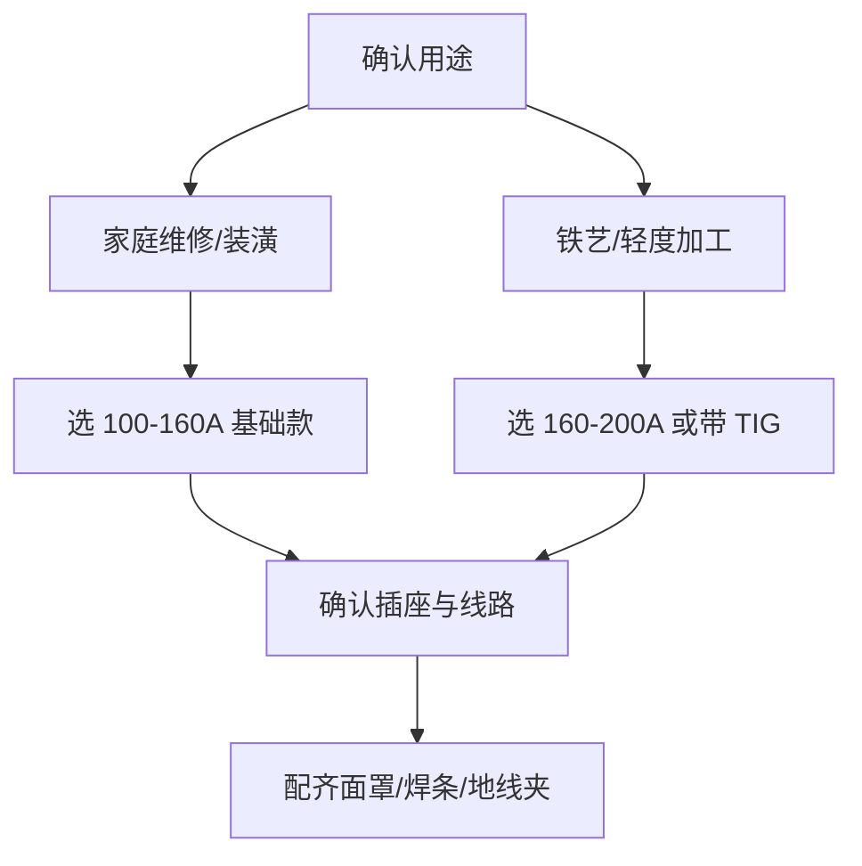

# 便携式家用焊机

> **一句话结论**：220V 单相供电、整机 5kg 以内的便携逆变焊机，适合家庭维修、装潢、农具修补与轻度铁艺加工，是个人用户的入门首选。

## 什么是便携式家用焊机

便携式家用焊机本质是**小功率逆变直流手工焊机**（部分型号附带 TIG 功能）。它把体积和电流都压缩到家用电路可承受的范围，用普通 220V 插座就能工作，因此成为家庭与小型作坊的常见配置。

## 选购要点

## 典型技术参数

| 参数项 | 参考范围 | 说明 |
|--------|---------|------|
| 额定输入电压 | 单相 220V ±15% | 电压波动大地区建议选宽压机型 |
| 输出电流范围 | 100–200A | 覆盖 1.6–2.5mm 焊条 |
| 适用焊条直径 | 1.6 / 2.0 / 2.5 / 3.2mm | 家用常用 2.5mm |
| 空载电压 | 50–65V | — |
| 额定负载持续率 | 35%–60% | 家用间断作业 35% 足够 |
| 适用板厚 | 1–6mm | 单面焊，厚板需开坡口多层 |
| 整机重量 | 2.5–5kg | 便携性是核心卖点 |
| 功能选配 | 防粘条、热引弧、VRD 防触电 | 新手建议选带防粘条的 |

## 适用场景

- **家庭维修**：铁门、栏杆、晾衣架、桌腿的焊补
- **装修装潢**：防盗窗、雨棚、小型钢架的现场焊接
- **农具修补**：锄头、犁架、农机小件的焊接
- **铁艺DIY**：手工铁艺、支架类作品的制作
- **户外轻度作业**：临时支架、围挡的固定

## 使用要点

### 线路条件是第一道门槛

| 线路项 | 建议要求 | 说明 |
|--------|---------|------|
| 插座规格 | 16A 独立插座 | 普通 10A 插座易跳闸 |
| 导线截面 | ≥ 2.5mm²（建议 4mm²） | 线径不足导致压降大 |
| 空气开关 | 独立回路 ≥ 20A | 避免与空调、电暖器等大功率设备共用 |
| 延长线 | 尽量不用；必须用时 ≥ 4mm² 且不超过 20m | 细长延长线是跳闸高发原因 |

### 焊条选择（按板厚）

| 板厚 | 建议焊条直径 | 参考电流 |
|------|-------------|---------|
| 1–2mm | 1.6mm 或 2.0mm | 40–70A |
| 2–4mm | 2.5mm | 70–110A |
| 4–6mm | 2.5mm（开坡口）或 3.2mm | 100–150A |

> **新手提示**：焊条直径偏大、电流偏低会导致引弧困难、熔深不足；焊条偏小、电流偏高则易烧穿薄板。建议从 2.5mm 焊条 + 中等电流开始练习。

## 使用与维护要点

| 项目 | 频次 | 做法 |
|------|------|------|
| 清理机内积灰 | 每 2–3 个月 | 断电吹扫（家用使用频率低，可适当放宽） |
| 检查插座与插头 | 每次使用前 | 看有无发热变色、接触是否牢固 |
| 检查焊把线与地线夹 | 每次使用前 | 破皮须处理，接头氧化须清理 |
| 长期停用 | 每年 | 通电空载运行 10 分钟驱潮 |

> **安全提示**：家庭环境焊接须远离易燃物（窗帘、木质家具、纸箱），作业区备灭火器；不要在潮湿地面或无接地条件下作业；焊接后工件温度高，须冷却后再接触。

## 常见问题（FAQ）

### Q1：200 元左右的焊机和 800 元的差别在哪？

主要差别在**实际输出能力与保护功能**：低价机常有"虚标电流"问题，标 200A 实际额定负载持续率下可能只有 120A；同时缺少防粘条、过热保护、VRD 等功能。家用偶尔用低价机可接受，经常使用建议选正规品牌的中端机型。

### Q2：家里插座一焊就跳闸怎么办？

先确认三件事：① 插座是否为 16A 独立回路；② 导线截面是否 ≥2.5mm²；③ 是否用了细长延长线。若都正常仍跳闸，说明焊机功率超线路承载能力，需要改用更低功率机型，或单独为焊接作业拉一条 4mm² 专线。

### Q3：家用焊机能焊不锈钢吗？

能，但要用不锈钢焊条（如 A102），且因家用机电流档位有限，焊薄不锈钢效果一般（容易烧穿）。如果主要需求就是焊不锈钢，建议考虑小型氩弧焊机，见[氩弧焊机](/products/tig)。

### Q4：便携焊机能长时间连续使用吗？

不能。家用机型负载持续率多为 35%–40%，即 10 分钟内建议焊接不超过 4 分钟，其余时间空载冷却。焊接后机身明显发烫属于正常，但若频繁触发过热保护，说明超出了负载能力，需要减少连续作业时间或升级机型。

**不确定家里线路能不能带动？** 把插座规格、导线截面和要焊的板厚发到 **mfujun@agent.qq.com**，或在[联系页面](/contact)留言，我们帮您判断。

