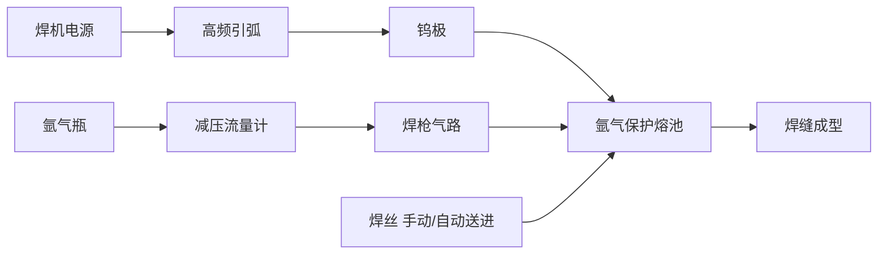

# 氩弧焊机（TIG）

> **一句话结论**：氩弧焊热输入精确可控、焊缝成型美观且无飞溅，是不锈钢、铝、钛及薄板焊接的首选工艺，也常用于管道打底焊。

## 什么是氩弧焊机

TIG（Tungsten Inert Gas）用**钨极**作不熔化电极，靠氩气保护熔池，焊丝单独送进。因为没有熔滴过渡飞溅、热输入调节精细，所以焊缝质量在常见手工工艺中最高。

## 工作原理

## 典型技术参数

| 参数项 | 参考范围 | 说明 |
|--------|---------|------|
| 额定输入电压 | 单相 220V / 三相 380V | 小型机多为 220V |
| 输出电流范围 | 160–400A | 薄板需低至 10–30A 精细档 |
| 空载电压 | 60–80V | 影响引弧 |
| 起弧方式 | 高频引弧 / 接触引弧 | 高频引弧不污染钨极，优先选 |
| 额定负载持续率 | 35%–60% | 长焊缝连续作业选高者 |
| 适用钨极直径 | 1.0 / 1.6 / 2.4 / 3.2mm | 按电流区间选择 |
| 适用板厚 | 0.5–8mm（打底） | 厚板多用于打底+其余工艺填充 |
| 保护气体 | 纯氩气（Ar ≥ 99.99%） | 铝焊可用氦氩混合气 |
| 功能选配 | 脉冲、交流（焊铝）、双用（TIG+手工焊） | 按需选择 |

## 交流与直流的区别

| 类型 | 适用母材 | 特点 |
|------|---------|------|
| 直流正接（DCEN） | 不锈钢、碳钢、钛、铜 | 熔深大、钨极寿命长，最常用 |
| 直流反接（DCEP） | 极少单独使用 | 有清洗作用但熔深小、钨极易烧损 |
| 交流（AC） | **铝、镁及其合金** | 正负半波交替，兼顾熔深与氧化膜破碎 |

> **关键点**：焊铝必须用**交流氩弧焊机**。直流机焊铝会因氧化膜无法破碎而焊不上。

## 适用场景

- **不锈钢制品**：厨具、栏杆、罐体、管件的薄板焊接
- **有色金属**：铝型材、铝制品的交流氩弧焊
- **管道打底焊**：单面焊双面成型，背面成型美观
- **薄板精密件**：0.5–3mm 板厚，避免烧穿
- **维修补焊**：精细部位的局部修复

## 选购要点

1. **是否需要交流功能**：要焊铝就**必须选交流氩弧焊机**，这是硬性门槛。
2. **最小电流档位**：焊薄板时 10–20A 的稳定输出很关键，低电流档不稳定的机型焊薄板容易烧穿。
3. **是否带脉冲功能**：脉冲 TIG 可进一步降低热输入，适合超薄板与全位置焊接。
4. **是否要双用（TIG+MMA）**：带手工焊功能的机型一机两用，适合维修场景。
5. **引弧方式**：高频引弧优于接触引弧，不污染钨极、不夹钨。
6. **水冷还是气冷焊枪**：长期大电流作业选水冷枪，间歇作业气冷枪即可。

## 工艺要点

| 项目 | 做法 |
|------|------|
| 钨极磨削 | 直流正接磨成**锥形尖**（夹角约 30°）；交流用**半球形端头** |
| 氩气流量 | 一般 6–12 L/min，过大易产生紊流反而保护不好 |
| 焊前清理 | 不锈钢用丙酮除油；铝材必须用不锈钢丝刷**机械去除氧化膜**（化学清洗后 4 小时内焊完） |
| 收弧处理 | 用收弧电流衰减功能，避免弧坑裂纹 |
| 层间温度 | 不锈钢控制较低，防止晶间腐蚀 |

## 使用与维护要点

| 项目 | 频次 | 做法 |
|------|------|------|
| 检查钨极与喷嘴 | 每班次 | 钨极夹钨或污染须重磨/更换，喷嘴飞溅物清理 |
| 检查氩气余量与气路 | 每班次 | 确认流量稳定、无漏气 |
| 清理焊机内部积灰 | 每 1–2 个月 | 断电吹扫 |
| 检查高频引弧针间隙 | 每季度 | 间隙过大导致引弧困难，按说明书调整 |
| 水冷机检查（如配） | 每周 | 查水位、水质、循环是否正常 |

> **安全提示**：氩气为惰性气体，在密闭空间泄漏会置换氧气导致窒息，作业区须通风；高频引弧可能干扰电子设备，注意与精密仪器保持距离。

## 常见问题（FAQ）

### Q1：氩弧焊能不能焊铝？

能，但**必须用交流（AC）氩弧焊机**。铝表面氧化膜熔点远高于铝本身，直流焊接无法破碎氧化膜。交流的正半波起清洗作用、负半波提供熔深，两者交替才能焊上。

### Q2：氩弧焊速度慢，厂里为什么不全部用它？

TIG 熔敷效率低，适合薄板、打底与质量要求高的位置。中厚板填充与盖面通常用气保焊或埋弧焊。实际生产常是"TIG 打底 + 气保焊盖面"的组合。

### Q3：喷嘴发红是什么原因？

通常是**氩气流量不足、气路堵塞或喷嘴直径过小**导致冷却不够。需立即停机检查流量计与气路，否则会烧坏喷嘴和焊枪。

### Q4：钨极碰到熔池了怎么办？

立即停止焊接，取出钨极，把被污染的端头**重新磨削**（用专用砂轮，注意钨极磨削粉尘有害，需除尘）。继续使用会造成夹钨、电弧不稳、焊缝质量下降。

**不确定该选直流还是交流、要不要脉冲？** 写明母材（不锈钢/铝/碳钢）、板厚与作业量，发至 **mfujun@agent.qq.com**，或到[联系页面](/contact)留言。

