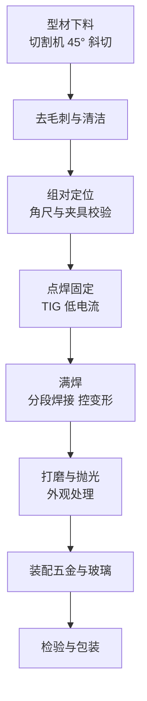

# 装修与门窗加工焊接方案

> **一句话结论**：门窗加工的关键是**外观质量与批量一致性**。推荐 TIG 氩弧焊保证焊缝美观（不锈钢/铝合金门窗），配等离子切割完成下料，形成小作坊的完整工艺链。

## 行业痛点

- **焊缝外观要求高**：门窗是可视面，焊疤、发黑、飞溅直接影响交付
- **材质多样导致工艺切换**：不锈钢和铝合金需要不同工艺，一台机难以覆盖
- **铝门窗焊接门槛高**：必须交流氩弧焊，直流机焊不上
- **下料尺寸精度影响装配**：切割质量差导致组对角尺超差
- **小作坊设备投入有限**：需要在有限预算内配齐下料与焊接两个环节

## 方案架构

## 设备配置建议

| 工序 | 工艺 | 参考机型类别 | 说明 |
|------|------|-------------|------|
| 型材下料 | 等离子切割 / 型材切割机 | 40–60A 切割机 | 斜切角度精度是装配关键 |
| 不锈钢门窗 | 直流 TIG 氩弧焊 | 氩弧焊机 200–300A | 焊缝美观、无飞溅 |
| 铝合金门窗 | **交流 TIG 氩弧焊** | 交流氩弧焊机 250–315A | 必须有交流功能 |
| 铁艺栏杆 | 手工焊 / 气保焊 | 手工焊机 200–250A | 碳钢件，成本优先 |
| 焊缝处理 | 打磨抛光 | 角磨机 + 抛光设备 | 外观交付的关键工序 |

## 按材质选工艺

| 材质 | 推荐工艺 | 焊材 | 关键控制点 |
|------|---------|------|-----------|
| 不锈钢 304/316 | 直流 TIG（DCEN） | 同材质焊丝（如 304 用 ER304） | 低热输入、背面充氩、焊后酸洗钝化 |
| 铝合金 6063 | **交流 TIG（AC）** | ER4043 / ER5356 焊丝 | 焊前机械去氧化膜、4 小时内焊完 |
| 碳钢型材 | 手工焊 / 气保焊 | J422 焊条 / ER70S-6 焊丝 | 成本优先，注意防锈 |
| 镀锌管件 | 手工焊（专用焊条） | 按材质选 | 烟尘防护、焊后补锌 |

## 关键参数参考

| 材质与厚度 | 工艺 | 参考电流 | 焊丝直径 | 氩气流量 |
|-----------|------|---------|---------|---------|
| 不锈钢 0.8–1.5mm | 直流 TIG | 40–80A | 1.6–2.0mm | 6–8 L/min |
| 不锈钢 1.5–3mm | 直流 TIG | 80–130A | 2.0–2.4mm | 8–10 L/min |
| 铝 1.0–2.0mm | 交流 TIG | 70–120A | 2.0–2.4mm | 10–12 L/min |
| 铝 2.0–4.0mm | 交流 TIG | 120–180A | 2.4–3.2mm | 12–15 L/min |
| 碳钢 2–4mm | 手工焊 | 70–120A | 2.5mm 焊条 | — |

## 外观质量控制的五个要点

| 要点 | 做法 | 效果 |
|------|------|------|
| 控制热输入 | 小电流、快焊速、必要时脉冲 | 减少氧化变色与变形 |
| 收弧处理 | 用衰减电流填满弧坑 | 避免弧坑裂纹与凹陷 |
| 背面充氩 | 管件内充氩气保护根部 | 内壁不氧化发黑 |
| 焊后处理 | 不锈钢酸洗钝化、铝件清洁 | 恢复耐蚀性、外观统一 |
| 打磨规范 | 用不锈钢专用砂轮（避免铁污染） | 防止碳钢污染导致点蚀 |

## 小作坊起步配置建议

按预算从低到高，可分三个阶段推进：

| 阶段 | 配置 | 能做什么 | 说明 |
|------|------|---------|------|
| 起步 | 手工焊机 + 型材切割机 | 碳钢栏杆、简易框架 | 投入最低，先接单 |
| 进阶 | + TIG 氩弧焊机（直流） | 不锈钢门窗 | 打开不锈钢业务 |
| 完善 | + 交流 TIG（或换交流两用机） | 铝合金门窗 | 覆盖铝材业务 |

> **一机多能的取舍**：带手工焊功能的 TIG 一体机适合起步阶段省预算；但业务量上来后，专机的稳定性与效率优势明显，建议按主要工艺配置专机。

## 常见问题（FAQ）

### Q1：不锈钢门窗焊接后发黑怎么办？

发黑是氧化（保护不良或热输入过大）。两条处理路径：① **预防**——提高氩气流量、降低电流、加快焊接速度、必要时背面充氩；② **补救**——用不锈钢酸洗钝化膏处理，可恢复银白外观与耐蚀性。注意轻微变色属正常，严重发黑发渣说明保护严重不足。

### Q2：铝门窗焊接必须要交流氩弧焊吗？

是。铝表面氧化膜熔点约 2050℃，远高于铝本身（约 660℃），直流焊接无法破碎氧化膜。交流氩弧焊的正半波起到"清洗"作用破碎氧化膜，负半波提供熔深，两者交替才能正常焊接。

### Q3：一台焊机能同时焊不锈钢和铝吗？

看机型。**交流氩弧焊机**通常同时支持交流（焊铝）和直流（焊不锈钢），因此可以一机两用。纯直流 TIG 机不能焊铝。选购时确认是否标注"AC/DC"。

### Q4：焊缝打磨用什么工具不容易出问题？

关键在**避免碳钢污染**。打磨不锈钢必须用**不锈钢专用的砂轮片和钢丝刷**，不能与碳钢件混用。碳钢颗粒嵌入不锈钢表面后，在潮湿环境中会成为点蚀源头，肉眼看不见但很快就会锈斑扩散。建议不锈钢与碳钢工具分色管理。

**需要为门窗加工厂配一套完整链条？** 写明常加工的材质（不锈钢/铝/碳钢）、型材规格与日产量，发至 **mfujun@agent.qq.com**，或在[联系页面](/contact)留言。

