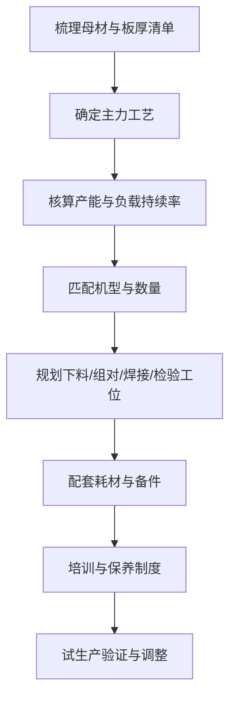

# 行业解决方案

不同行业的焊接需求差异很大——母材、板厚、产量、作业环境、质量验收标准都不同，因此设备配置思路也不一样。本栏目按行业拆分，给出完整的设备匹配逻辑与实施步骤。

## 四大行业方案

<a class="dhj-card" href="@BASE@/solutions/steel-structure">
  
钢结构加工厂焊接方案

  
H 型钢、檩条、支架的批量焊接。以气保焊为主力、手工焊补位，兼顾效率与现场适应性。

  
查看方案 →

</a>

<a class="dhj-card" href="@BASE@/solutions/pressure-vessel">
  
压力容器与管道焊接方案

  
质量优先场景。TIG 打底 + 气保焊填充盖面，重点在工艺评定、层间温度与无损检测配合。

  
查看方案 →

</a>

<a class="dhj-card" href="@BASE@/solutions/auto-repair">
  
汽车维修改装焊接方案

  
薄板车身与结构件并重。需要低热输入控制变形，多用气保焊配细焊丝，辅以手工焊修结构件。

  
查看方案 →

</a>

<a class="dhj-card" href="@BASE@/solutions/decoration">
  
装修与门窗加工焊接方案

  
不锈钢与铝合金门窗为主。TIG 保证外观成型，配合切割设备完成下料，形成小作坊完整链条。

  
查看方案 →

</a>

## 方案编制的通用逻辑

所有行业方案都遵循同一套推导过程，您可以按这个框架自行评估需求：

## 按场景速查配置思路

| 行业场景 | 主力工艺 | 辅助工艺 | 关键关注点 |
|---------|---------|---------|-----------|
| 钢结构加工 | 气保焊（1.2mm 焊丝） | 手工焊 | 负载持续率、防风、批量效率 |
| 压力容器管道 | TIG 打底 + 气保焊盖面 | 手工焊 | 工艺评定、层间温度、焊材烘干 |
| 汽车维修改装 | 气保焊（0.8mm 焊丝） | 手工焊、点焊 | 低热输入、防变形、镀锌板处理 |
| 装饰门窗加工 | TIG（不锈钢/铝） | 手工焊 | 焊缝外观、切割下料配套 |
| 设备维修抢修 | 手工焊 | TIG、等离子切割 | 便携性、户外适应性、快速响应 |

## 常见问题

### Q1：方案是标准模板还是按需定制？

框架是标准化的（上图的推导逻辑），但**参数与配置按需推导**。每个方案页给出的机型类别与电流区间是通用参考，具体选型需要结合您的母材清单与产量核算。

### Q2：方案里会推荐具体品牌型号吗？

本栏目聚焦**工艺与配置逻辑**，不绑定具体品牌。这样方案在换供应商后依然适用，也避免因型号更新导致内容过期。

### Q3：只有一个工种、规模很小，也适用吗？

适用。方案框架同样适合小作坊——只是把"多工位配置"简化为"一机多用"。比如门窗加工作坊可以一台 TIG 一体机配合切割机起步，后续按业务量增加设备。

### Q4：能帮我们做具体的配置清单吗？

可以。请提供母材与板厚清单、预期日产量、现有供电条件和预算区间，通过[联系页面](/contact)留言或发至 **mfujun@agent.qq.com**。
