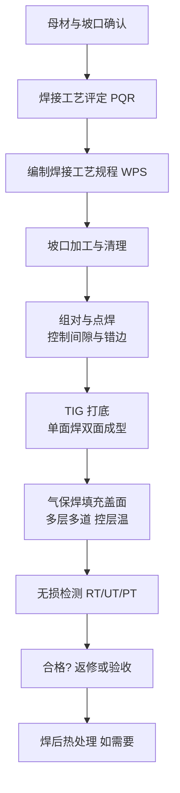

# 压力容器与管道焊接方案

> **一句话结论**：压力容器与管道的核心诉求是**质量可追溯、工艺可评定**。推荐"TIG 打底 + 气保焊填充盖面"的组合工艺，重点不在设备档次而在工艺纪律。

## 行业痛点

- **根部质量难保证**：单面焊双面成型对打底工艺要求高，未焊透、内凹是高频缺陷
- **层间温度失控**：厚壁多层焊时层间温度过高导致韧性下降
- **焊材管理松散**：碱性焊条未按规范烘干，直接造成气孔与氢致裂纹
- **工艺评定缺失**：焊接工艺参数无依据、无记录，无法通过验收
- **无损检测不合格返修**：返修成本高，且返修本身可能引入新缺陷

## 方案架构

## 设备配置建议

| 工序 | 工艺 | 参考机型类别 | 说明 |
|------|------|-------------|------|
| 坡口加工 | 等离子切割/机械加工 | 等离子切割机 | 坡口面须平整无氧化 |
| 根部打底 | 直流 TIG（氩弧焊） | 氩弧焊机 300–400A | 需精细低电流与收弧衰减 |
| 填充盖面 | 二氧化碳气保焊 | 气保焊机 350–500A | 效率与质量平衡 |
| 补焊返修 | 手工焊 | 手工焊机 400A | 碱性焊条，局部返修 |
| 焊材烘干 | — | 焊条烘干箱 + 保温筒 | **必备**，非可选 |

## 关键工艺控制点

| 控制项 | 要求 | 不做的后果 |
|--------|------|-----------|
| 焊材烘干 | 碱性焊条 350℃×1h，随用随取（保温筒） | 气孔、氢致裂纹 |
| 坡口清洁 | 油锈清除至金属光泽，两侧 20mm 内 | 气孔、夹渣 |
| 组对间隙 | 按 WPS 规定，通常 2–3mm | 未焊透或烧穿 |
| 层间温度 | 碳钢一般 ≤250℃，不锈钢按规范更低 | 韧性下降、晶间腐蚀 |
| 层间清渣 | 每道彻底清理 | 夹渣、未熔合 |
| 收弧处理 | 用衰减电流填满弧坑 | 弧坑裂纹 |
| 预热/后热 | 高强钢、厚壁按 WPS 执行 | 冷裂纹 |

## 打底焊的两种路径

| 方式 | 特点 | 适用 |
|------|------|------|
| TIG 打底 | 质量最好、背面成型美观、速度慢 | 质量要求高、小管径、重要焊缝 |
| 手工焊打底（碱性焊条） | 效率较高、需熟练工 | 大管径、现场安装 |
| 气保焊打底 | 效率高、参数需精确控制 | 批量生产、有工装条件 |

## 常见问题（FAQ）

### Q1：必须做焊接工艺评定吗？

按相关特种设备监管要求，压力容器与压力管道焊接通常需要依据评定合格的焊接工艺施焊。**具体适用范围与执行要求请以现行法规标准及当地监管部门的规定为准**，建议在方案设计阶段就与检验机构确认。

### Q2：为什么碱性焊条必须烘干？

碱性焊条药皮易吸潮，水分在电弧高温下分解出氢。氢溶入熔池后在凝固和冷却过程中析出，会在高应力区形成**氢致延迟裂纹**，这类裂纹可能在焊后数小时甚至数天才出现，隐蔽性极强。所以规范要求烘干温度与保温时间，并使用保温筒随用随取。

### Q3：不锈钢管道焊接有什么特别注意？

三点最关键：① **热输入要低**（小电流、快焊速、层间温度控制严），避免晶间腐蚀敏感区；② **背面要充氩保护**，否则根部氧化发黑影响耐蚀性；③ **禁止用碳钢工具清理**（不锈钢刷、专用砂轮），避免铁污染引发点蚀。

### Q4：返修次数要控制吗？

要。返修会多次加热同一区域，使组织劣化、应力增大，且返修区更易再次开裂。通常同一部位返修次数有上限要求，超限可能需要割除重焊。**返修前应分析根本原因**，而不是简单重焊。

**需要针对具体材质与壁厚做工艺匹配？** 写明母材牌号、壁厚、管径与执行标准，发至 **mfujun@agent.qq.com**，或到[联系页面](/contact)留言。

